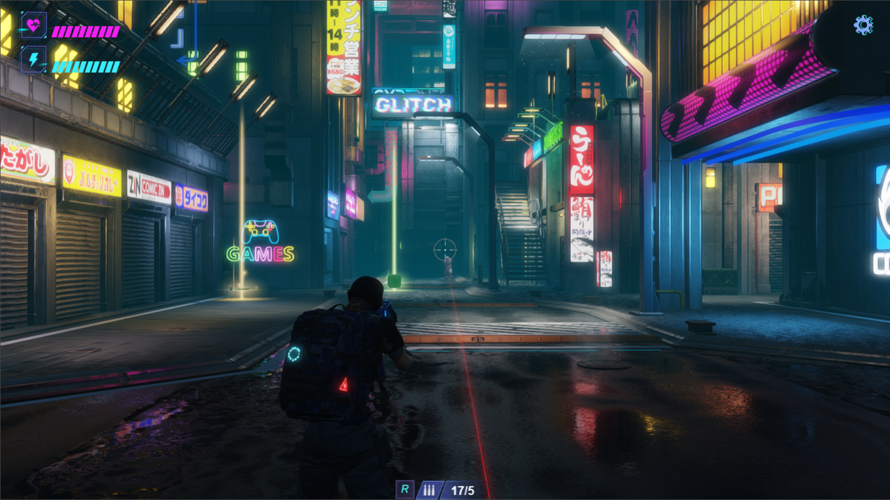

# Cocos Cyberpunk 源码导读 - 开篇


Cocos Cyberpunk 是 Cocos 引擎官方团队以展示引擎重度 3D 游戏制作能力，提升社区学习动力而推出的完整开源 TPS 3D游戏，支持 Web, IOS, Android 多端发布。

本系列文章将从各个方面对源码进行解读，提升大家的学习效率。希望能够帮助大家在 3D 游戏开发的路上更进一步。

工程源码免费下载页面:
[https://store.cocos.com/app/detail/4543](https://store.cocos.com/app/detail/4543)

---

```cg
“HEY，麒麟子，最近突然觉得，有一个词好适合你”

“嗯？什么词？”

“姜郎才尽。”

“。。。。”

“你看吧，这都停更多久了，硬是没憋出一个字”。

“。。。。，行，我写！”
```

Hello大家好，请叫我麒麟鸽。

时间过得真快，离上次发文，又过了好几个月了。

赶时间的朋友，可以直接下拉，跳到：**Cocos Cyberpunk 中可复用的技术资产**



其实大家有所不知，麒麟子平时写文章，既要保证干货满满，又要紧扣 Cocos 这一主题，同时还不想让别人看出来我是 Cocos 的托。挺难的，请多多包涵。

## 什么是 Cocos Cyberpunk

## Cocos Creator 3.7 中的新特性

一不留神，Cocos Creator 3.7 都发布了， 最想要的**自定义渲染管线**、**光照探针**、**反射探针**都有了。


有了这三个神器，场景渲染又能能上升好几个台阶。

值得说明的是， 3.7 新增的特性很多，与时同时，引擎文档组也花了大量的时间，很详细地更新新了文档。大家可以直接去文档查看对应内容，对文档有什么疑惑和建议，欢迎随时反馈。

哦，还有 **模型 LOD** 系统，听说最多支持 **7** 个级别，根据模型在屏幕上的显示占比动态选择使用等级，能够十分有效地降低大场景的渲染负担，提升运行性能。

提到 LOD，大部分人第一反应就是制作不同细节的 Mesh 从而实现 **Mesh LOD**，但大家有所不知： **Mesh LOD 其实是一个可选项，而不是首选项，真正的首选项，是材质 LOD。**

复杂的材质给 GPU 带来的渲染负担，远远大于模型面数。对于很多项目来说，材质 LOD 就足够胜任了。它不需要对 Mesh 进行处理，只需要编辑好不同级别使用的材质，就能提升很多性能。

而当遇上面数超标的情况下，应该考虑 Culling（比如，使用PVS，让被遮挡的模型不显示，使用距离判断，让较远的小型物体不显示），而不是做 Mesh LOD。 只有当材质 LOD 和 Culling 综合使用后依然满足不了需求，才需要考虑 Mesh LOD。

由于每一层 LOD 其实是单独的节点，所以，材质也是可以进行 LOD 的。
比如当物体在近处渲染时，用最高效果的 PBR 材质。处于较远的位置时，可以关闭一些细节。当处于特别远的时候，可以退化为 unlit 材质。

不过呢，模型 LOD 这个特性，麒麟子还没有仔细用过，暂时就不深入讨论了。

## 来自引擎团队的福利

更令人惊喜的是，为了证明 Cocos Creator 3.7 确实不错，引擎团队还发布了一款 TPS 游戏DEMO《Cocos Cyberpunk》，并且把项目工程源码 100% 开源了。

有大佬还专门写了篇文章：**《13万行代码+50万外包美术的 3D 示例，Cocos 免费送啦！》**


不得不说，这标题，起得可真好，连见过大世面的麒麟子都有点把持不住。

虽然有点激动，但在下载代码之前，麒麟子还是向负责 Cyberpunk 项目的同事们再三确认了一些问题，有可能也是大家在下载之前想要问的问题：

**麒麟子:“用了最新版的自定义管线吗？”**

答：“肯定的啊，自定义的延迟渲染管线、Bloom、TAA、FSR 什么的，都得用。”

**麒麟子：“改引擎了吗？需要用户做什么特别的配置吗？”**

答：“新版的自定义管线代码是直接用 TS 写在项目中的，不需要自定义引擎。 直接用 Cocos Creator 3.7.1 打开就可以了。”

**麒麟子：“性能如何，手机上能跑吗？”**

答：“肯定啊，Web 和 Android 原生都可以跑。 最低支持 小米6，30FPS。 我们做了机型适配，根据不同性能的机型调整画质、保持帧率”

**麒麟子：“我不信”**

答：“不信你问我那么多干啥，自己去 Cocos Store 下载，打个包运行起来看。”

## Cocos Cyberpunk 可复用的技术资产

麒麟子花了一天时间，研究了 Cyberpunk 项目，并且听了 Cocos 官方 B 站的直播，大概把项目摸熟了。

个人体验来看，项目还是非常清晰明了的，可以作为不错的学习资源，也可以将它作为项目框架，在它上面进行项目开发。

它包含了以下特性：

**1、完整的TPS游戏核心**

虽然目前的角色控制效果还有很多提升细节的空间，但它已经是一个完整的射击游戏逻辑了。

- 角色控制
- 上下身动作分离，移动中射击
- 射击、弹道、弹孔、火舌、命中 逻辑
- 怪物生成、怪物寻路、怪物AI

**2、机型适配机制**

3D游戏与2D游戏不同，3D游戏的画质需要更高的设备性能支撑。 因此我们通常会在高性能设备上实现最佳效果，而在较次的设备上通过调节效果来确保帧率。 Cocos Cyberpunk 中实现了完整的机型分档和性能开关策略，可以搬到自己的项目中直接使用。

- 根据手机 GPU 信息，划分高、中、低端机型（已将常见 手机 GPU 芯片 纳入）
- 根据高中低端机型进行效果调节，确保低端机依然流畅

**3、自定义管线**

在 Cocos Cyberpunk 中，使用了 Cocos Creator 3.7 提供的全新的自定义管线，并且以extension形式放在了项目中，做到了非常好的隔离性。自己的项目需要的话，可直接复用，也可以作为研究新版自定义管线的学习案例。
- 实现了前向渲染管线和延迟渲染管线，可以根据项目情况直接复用
- 实现了后处理管线与框架，提供了Bloom、TAA、FSR等常见技术，也可以非常方便添加自己需要的后处理效果
- 可视化自定义管线图，可以非常直观地看到管线渲染流程

**4、加强版反射探针**

预先烘焙好的反射探针，可以使物体反射周围的景物，同时又不至于有性能损伤。是一个非常简单易用的特性，大家一定要多用。
- 采用 Cocos Creator 3.7 中的反射探针进行烘焙
- 使用 SphereProjection 做了矫正，使得反射内容与物体接近吻合
- 提供了实时的环境反射探针组件，主要功能是方便在编辑器调试，也可以用在一些简单的场景中增强反射效果。

**5、静态遮挡剔除（PVS-SOC）**

最快的渲染一个物体的方法就是：不渲染。
在 Cocos Cyberpunk 项目中，实现了一套简单易用的 PVS 机制。 通过将可见关系预先存入空间格子，在渲染时直接查表获得渲染列表，能够极大地提升效率，对建筑密集的场景最为实用。

- 将空间预先切分为许多格子
- 预先使用射线查询的方式，找出每一个格子可见的对象，并记录其ID（使用了 gpu.js 加速）
- 渲染时，计算出摄像机处于哪一个格子，获得对应格子的可见静态对象列表，仅渲染可见的静态对象

对了，由于项目类型的原因，前面提到的 Cocos Creator 3.7 中新增的 光照探针和 LOD 并没有使用，回头麒麟子找点适合的列子来分享。。

麒麟子觉得，Cocos Cyberpunk 中的应该远不止上面提到的这些，如果再多花些时间挖掘，肯定还会有更多收获。

因此，接下来麒麟子会将上面用到的技术点都研究一遍，并输出一些内容，希望和大家一起探讨学习。

## 最后说一下


很多朋友经常问麒麟子，学完引擎基础和图形基础后，如何提升自己的实战能力。
这个答案很简单：找个项目做做。
如果没有机会做项目，怎么办呢？
找个开源项目就好啦。

Cocos Cyberpunk 就是为这个目的而立项的， 希望能够让更多的朋友，使用 Cocos Creator 做出更多炫酷的项目。

还等啥呢，赶紧学起来。 [Cocos Cyberpunk 3D Source Code](https://store.cocos.com/app/detail/4543)
