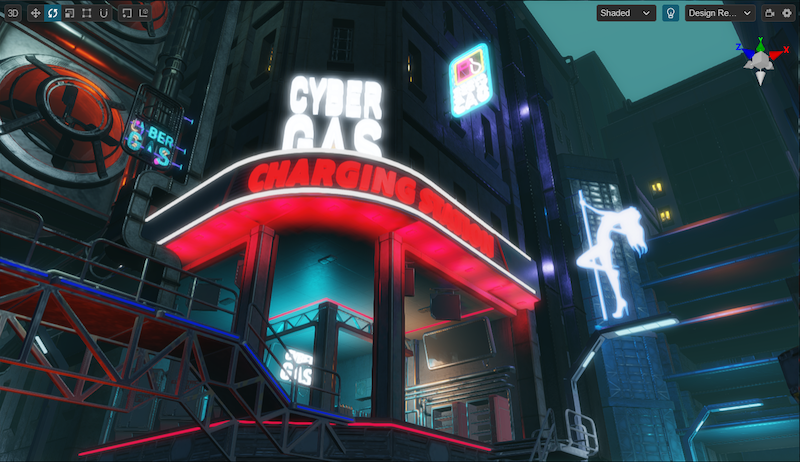
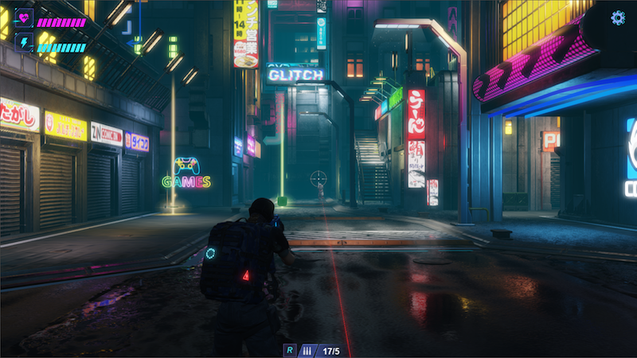

# Guide to Cocos Cyberpunk Source Code - Introduction

Hey everyone, Kylin here! Today, I am thrilled to share with you an amazing 3D shooter game project that I think you'll love. Not only is it 100% open source, but it is also an excellent resource for those who are learning game development and looking for a solid foundation to create their own games. So, let's dive in and check out what this incredible project has to offer!

Cocos Cyberpunk is an open source 3D TPS (Third-person Shooter) game, developed by the Cocos Engine team, which can be published to iOS, Android and Web.

The purpose of developing Cocos Cyberpunk is to showcase the Cocos Engine's ability to create complex 3D games on multiple platforms and to motivate the developers in Cocos community to learn game development.  

This series of articles could be treated as a project guide of the Cocos Cyberpunk that is intended to help you and save your time.

Get it for free:
[https://store.cocos.com/app/detail/4543](https://store.cocos.com/app/detail/4543)

---

If you are short on time, you can skip ahead to the section titled: **Valuable Tips and Tools Available in Cocos Cyberpunk**.

## New features in Cocos Creator v3.7

How time flies, the Cocos Engine team has released the latest version, Cocos Creator v3.7.

The latest release includes some of the most highly anticipated features, such as **Custom Render Pipeline**, **Light Probe**, **Reflection Probe** and **LOD**.

By utilizing these powerful features, the graphics of your games will become more realistic.

It's important to mention that the Cocos Creator documentation has been significantly improved by the team, with the addition of many new features and details.

If you have any questions, you can refer to the corresponding documentation. The team welcomes your feedback and is happy to assist you.

## A gift from the Cocos Engine team

Even more surprising, the Cocos Engine team has released a 3D TPS game demo called called **Cocos Cyberpunk** to demonstrate that Cocos Creator 3.7 is capable of handling big projects. The source code of the project has also been made 100% open source.

Get it for free:
[https://store.cocos.com/app/detail/4543](https://store.cocos.com/app/detail/4543)

Despite my excitement, I consulted with the person responsible for the graphics in Cocos Cyberpunk to verify certain aspects before downloading from the Cocos Store. These maybe the same questions before you downloading.

**Kylin: Do you use the Custom Render Pipeline that is available with Cocos Creator v3.7?**

Answer：Certainly, the Custom Render Pipeline is necessary for effects such as Bloom, TAA, FSR and so on.

**Kylin: Have you made any modifications to the engine? Do users need configure anything?**

Answer: There is no need to modify any code of the engine as the latest version of Cocos Creator allows users to write their own Custom Render Pipeline in TS within project folder. Users can open Cocos Cyberpunk using Cocos Creator 3.7.2 without any additional configuration.

**Kylin：What's the performance like? Is it compatible with mobile devices?**

Answer: The performance is excellent and it is compatible with both web and native platforms. Additionally, it has a highly compatibility with low-end devices, with the lowest-end device being XiaoMI 8 running at 30 FPS.

**Kylin: How do you get such high performance on low-end devices?**

Answer: We have done a lof of optimization and adaptation work for various levels of devices to archive hight performance. For instance, we optimize the graphics settings and disable certain effects based on the GPU of the device to maintain the frame rate.

## Valuable Tips and Tools Available in Cocos Cyberpunk

After spending almost a whole day studying the project and watching the live stream on Bilibili provided by the Cocos Engine team. I believe that I am now somewhat familiar with it.

Based on my experience, the project structure is well-organized and easy to understand. It can be used as a useful learning resource for game development as well as a solid foundation for building new games.

The following items are most useful:

**1. A complete framwork for developing TPS games**

Despite the imperfect gameplay experience, it offers a complete shooting game framework.

- Character controller
- Separate animations for the upper and lower body 
- Shooting while in motion
- Shooting mechanics, bullet tracking, bullet decals, hit detecting
- Enemy spawning, pathfinding and AI

**2. Wide compatibility range from high-end to low-end devices**

Compare to 2d games, 3D games require more processing power from the device. To ensure that Cocos Cyberpunk can run smoothly on from high-end to low-end devices, we prioritize the best graphics on high-end devices and disable some unnecessary effects to maintain a smooth FPS on mid-end and low-end devices. It's a comprehensive solution and can be easily adapted and reused in your own project.

- Classify devices as high-end,middle-end,low-end based on their GPU performance
- A list of GPUs commonly found on mobile devices, which are classified into different levels
- Adjust graphics settings and disable certain effect according to the level of devices.

**3. Custom Render Pipeline**

Cocos Cyberpunk used the Custom Render Pipeline, which is a new feature offered in Cocos Creator 3.7. It is implemented as an extension that allows to be easily reused in your own project.

You can quickly incorporate it into your own project simply by copying and pasting the code, or use it as a valuable example to learn from.

- Forward and Deferred Render Pipeline has been implemented in the project.
- A post process framework offered many useful effects Bloom, TAA, FSR. It's also easy to add a new effect.
- Visualized Custom Render Pipeline Graph, makes the pipeline easy to be understood.

**4. Reflection Probe**

Pre-baked Reflection Probe is an excellent technique to enhance the appearance of object's surface without compromising on performance.

Reflection Probes also can be used to simulate shallow puddles on the ground with the projection correction technique.

**5. Static Occlusion Culling**

The fastest way to render an object is to simply not render it.

In the Cocos Cyberpunk project, a culling technique called PVS-SOC ( which is short for Potential Visibility Set - Static Occlusion Culling) is used for culling objects out of camera view.

By storing the relationship of visibility between the static objects and camera. the SOC system implemented in Cocos Cyberpunk let the objects out of view can be removed quickly during rendering. This approach is highly efficient and particularly useful for scenes that contains numerous static buildings.

The primary stages of the SOC system are:

- Divide the 3D space into grids
- For each grid, use rays to identify the visible objects when camera is in it, then record the ID.（ gpu.js is used to speed up）
- lookup the grid where camera is in to get the visible objects during rendering.

I believe that there are many more treasures to discover in Cocos Cyberpunk beyond mentioned above. With more time invested, there are surely more valuable things to be gained.

In the next, I plan to study all of the points mentioned above and create some articles about them. I hope encourage more individuals to join me in this learning journey.

Come on!

## Summary

Many friends in community asked me about how to continue learning game development, how to improve their skills after completing beginner-level courses.

The answer is quite simple: Explore a project to work on.

Perhaps some people may struggle to find a fitting project. In that case, what can be done?

Learning from an well-organized open source project would be the best choice.

Cocos Cyberpunk primary for this purpose, hope more people to use Cocos Creator to make even more amazing games.

What are you waiting for? Get it for free and start you learning journey now! [Cocos Cyberpunk 3D Source Code](https://store.cocos.com/app/en/detail/4543)
