# The project structure

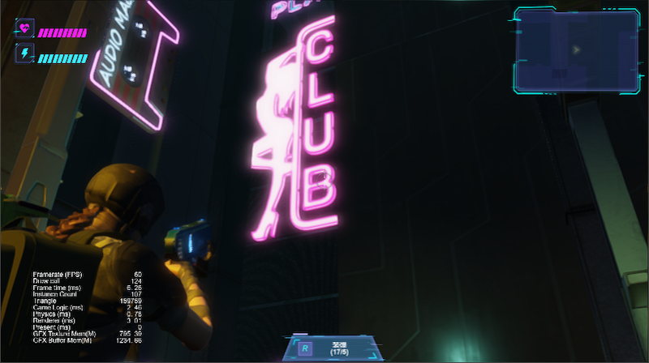

Hey everyone, Kylin here!

In my previous post, I mentioned that I would be write a series of articles on Cocos Cyberpunk. So let's kick off with the project's structure and delve deeper into it.

For someone who didn't know Cocos Cyberpunk, it is an open source 3D TPS (Third-person Shooter) game, developed by the Cocos Engine team, which can be published to iOS, Android and Web.

The purpose of developing Cocos Cyberpunk is to showcase the Cocos Engine's ability to create complex 3D games on multiple platforms and to motivate the developers in Cocos community to learn game development.  

This series of articles could be treated as a project guide to the Cocos Cyberpunk that is intended to help you and save your time.

Get it for free:
[https://store.cocos.com/app/detail/4543](https://store.cocos.com/app/detail/4543)

## Features in Cyberpunk

Before we get started, let's list out the features provided in Cocos Cyberpunk again.

- 1、**Comprehensive TPS gameplay framework**
- 2、**A reusable implementation of Custom Render Pipeline**
- 3、**Forward & Deferred Rendering, PostProcessing**
- 4、**Usage of Reflection Probes**
- 5、**Static Occlusion Culling**
- 6、**Compatible with High-end, Mid-end and Low-end devices**

In this article, we will locate the files that correspond to the features above.

## How to play

Before we begin, it's better to spend a few minutes to play it. So you can get a feel for what it looks like.

1. Open the scene named **scene-game-start** and click on the preview button to run the game, you will see the following screen.
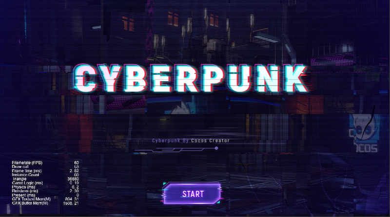

2. Click the **START** button, proceed to the gameplay.
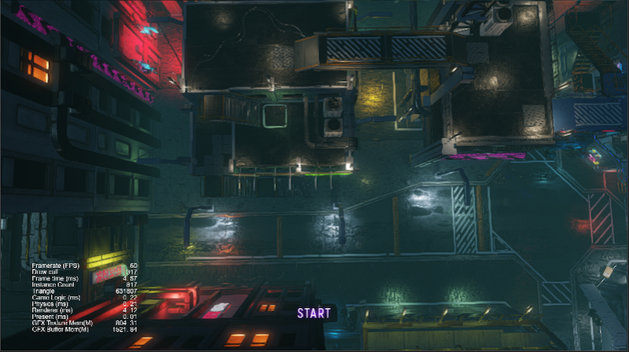

3. There is a camera that guides you through the entire scene. You can click on the "START" button to begin playing.
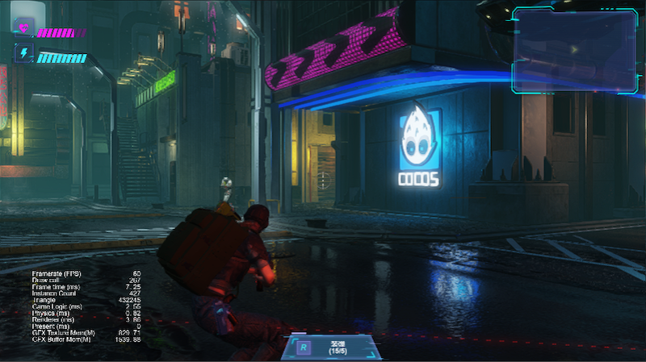

4. You can access the help menu by pressing ESC key (or clicking on the settings button if you're playing it on a mobile device).

## Structure

Next, let's move on to the project's structure.

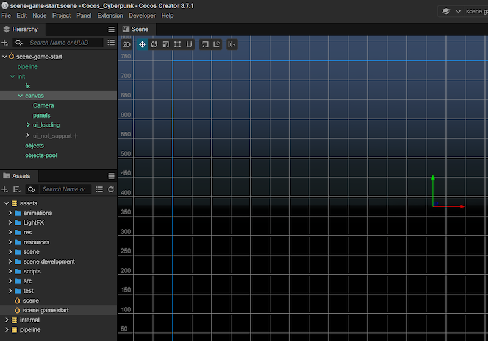

As shown in the picture above, when you open the Cocos Cyberpunk project, you will see the folders in the Assets window at the left bottom corner of Cocos Creator.

Let's take a look at each of them one by one.

### 1、animations

There is only one animation file under the folder, which is used for camera animation during roaming the scene when start.

### 2、LightFX

The lightmaps generated by the Lightmap Baking System will be automatically stored in this folder, and there is no need to manually modify the contents inside it.

### 3、res

it contains all the resources used in this game. including animations,effects,models,shaders,ui,sounds and so on.

### 4、resources

This specific folder is for resources which will be loaded during gameplay. it doesn't have many files inside it at the moment, but will be added as the gameplay expands.

### 5、scene

The cube textures produced by the Reflection Probe baking system will be automatically saved in a folder specific to each scene. The folder named "scene" is for the scene with that name.

### 6、scene-development

This folder is used to store scenes for testing purpose, such as character controller, bullet, IK, raycast and so on.

### 7、scripts

Store all of the gameplay scripts.

### 8、src

Some tests, unrelated to the gameplay.

### 9、test

Some tests, unrelated to the gameplay.

### 10、scene.scene

The scene of gameplay, I think it's better to be named: gameplay.scene.

### 11、scene-game-start.scene

The start scene, initializes the gameplay framework, loads the gameplay scene ,shows loading progress etc.

## Custom Render Pipeline

For easier reusability, the Custom Render Pipeline has been implemented as an Cocos Creator extension. However, if preferred, it can also be moved into the project folder.

The root folder named "pipeline" is intended for the Custom Render Pipeline, which is shown as bellow.

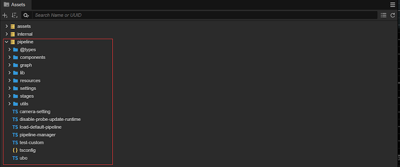

Next, let's see how to open the pipeline window.

To start, you need to create an empty node, add pipeline/graph/pipeline-graph.ts as its component.

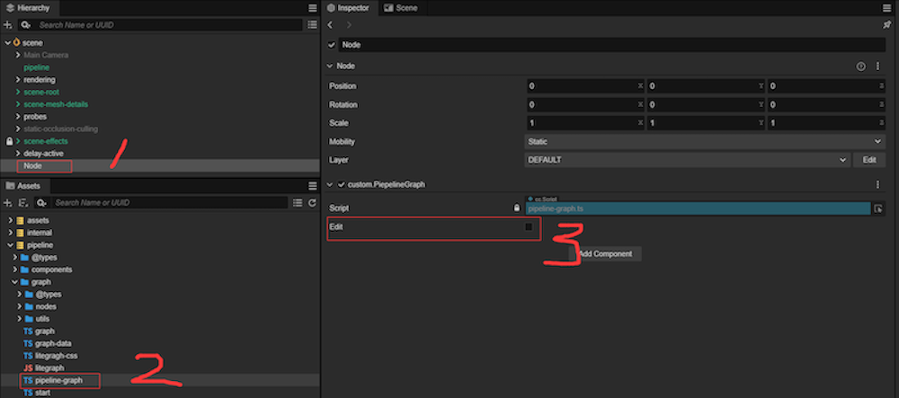

Then, click on **Edit** checkbox,  you can see the pipeline window shown as follows.

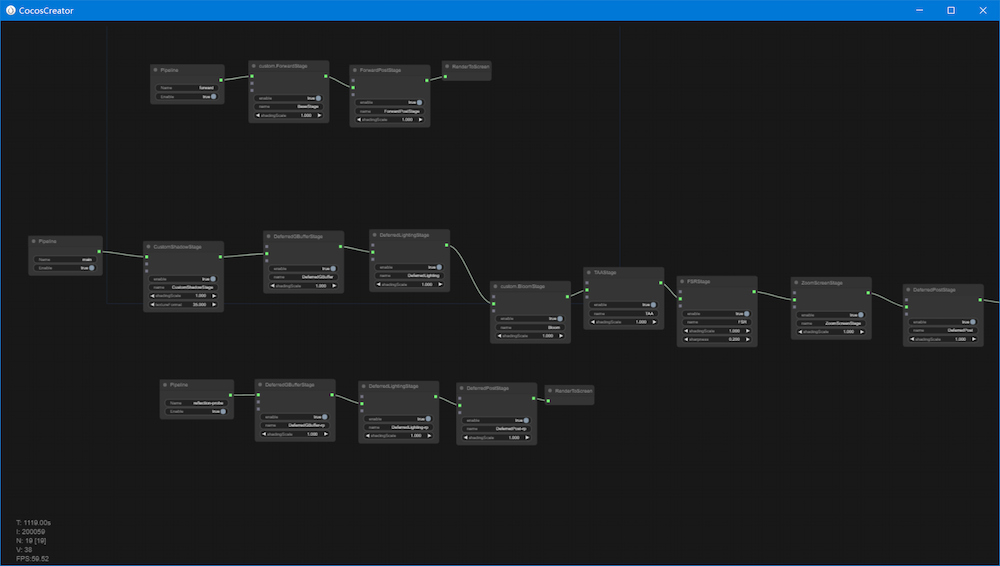

For Custom Render Pipeline is too complex to be explained in a few sentences. Therefore, we won't delve into it in-depth in this article. However, we will cover it in more detail in upcoming articles.

If you can't wait, you can explore it on you own with the following prompts to get started quickly.

- pipeline/pipeline-manager (the entry)
- pipeline/graph
- pipeline/passes

## Reflection Probe

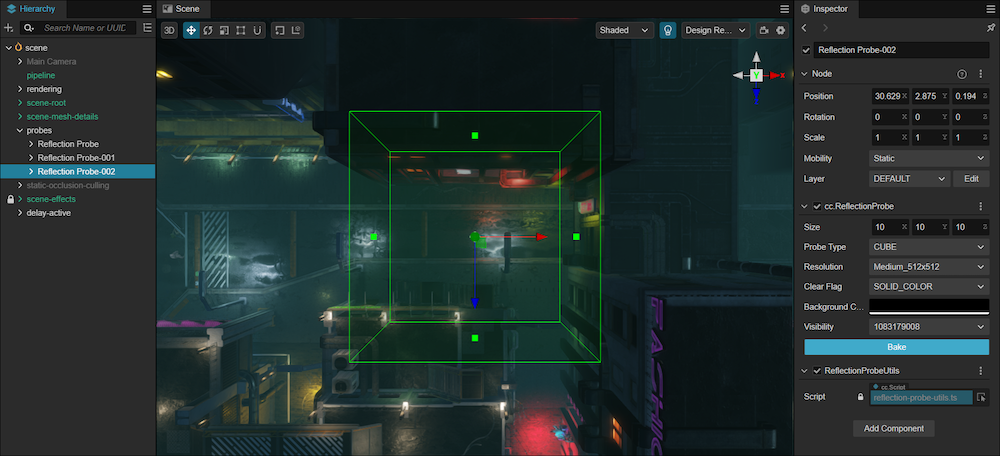

In the "scene" scene, select the "probes" node, you can find there are 3 reflection probes, the corresponding cube textures are stored in the assets/scene folder.

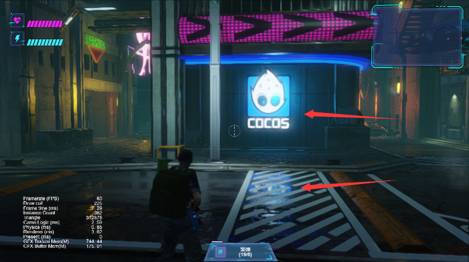

The texture mapping of the Reflection Probe involves more than a simple environment cubemap mapping, it utilizes Projection Correction to ensure the reflection content matches the original.

The basic principle as shown below.

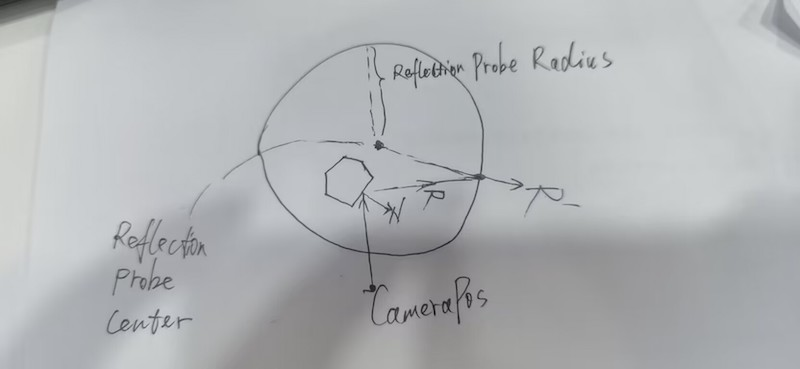

You can refer to pipeline/resources/effects/chunks/lighting_ibl.chunk for more detail.

## Static Occlusion Culling

In Cocos Cyberpunk, a simple and useful PVS system has been implemented to improve culling performance.

By storing the visibility relationship into the grids, it allows to quickly get the visible objects during rendering. This approach can significantly improve the performance and is particularly useful for scenes with lots of static buildings and objects.

You can check the node named "static-occlusion-culling" in the scene for more detail.

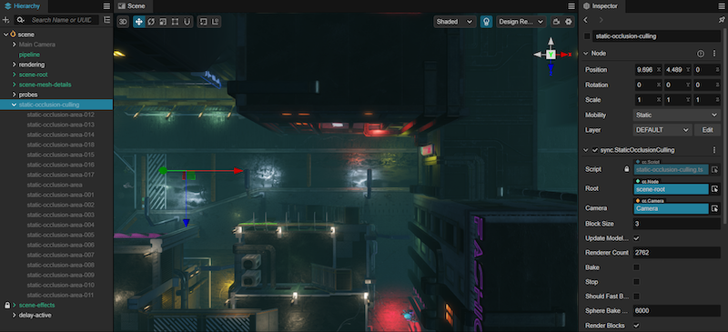

The basic idea is as follows.

- 1、**Divide 3D space into grids**
- 2、**Use lots rays to identify the visible objects for each grid and record the IDs**
- 3、**Check the grid which the camera is located to get the visible objects during rendering**

Please refer to pipeline/occlusion-culling for more detail.

## Compatible with High-end, Mid-end and Low-end devices

Cocos Cyberpunk features a comprehensive solution for classifying devices into different levels, as well as adjusting graphics settings and enabling/disabling effect based on the device's performance level.  

The solution is founded on a fundamental strategy. On high-end devices, the primary goal is to ensure that the graphics are of high quality and maintain a stable FPS, on middle-end and low-end devices, we only focus on maintaining a certain FPS by reducing the quality of graphics and disabling some effects if necessary.

This approach is widely used in 3D projects and can be applied to you own project directly.

It contains to main steps as below.

- Divide devices into different levels according to the GPU performance level.
- Adjust graphics settings and disable effects based on the device's level to maintain a smooth FPS.

For more detail, please refer to href-settings.ts, gpu.ts and gpu-mobiles.ts .

The relevant code is shown below.

```ts
 let mobileSettings = [
    {
        score: 2000,
        shadingScale: Math.min(1240 / game.canvas.width, 1),
        bloom: 0,
        fxaa: 0
    },
    {
        score: 1200,
        shadingScale: Math.min(1024 / game.canvas.width, 1),
    },
    {
        score: 500,
        gpu: [['apple', 'a10']],
        fsr: 0,
        taa: 0,
        maxEnemies: 2,
        sceneParticles: 0
    }
]
```

You can modify the code manually to quickly test the graphics on various levels.

## Gameplay

Cocos Cyberpunk offers a complete TPS gameplay framework, which can be used both as a learning resource for game development and as a foundation for developing your own new game.

To begin, you can access to the scene named "scene-game-start".

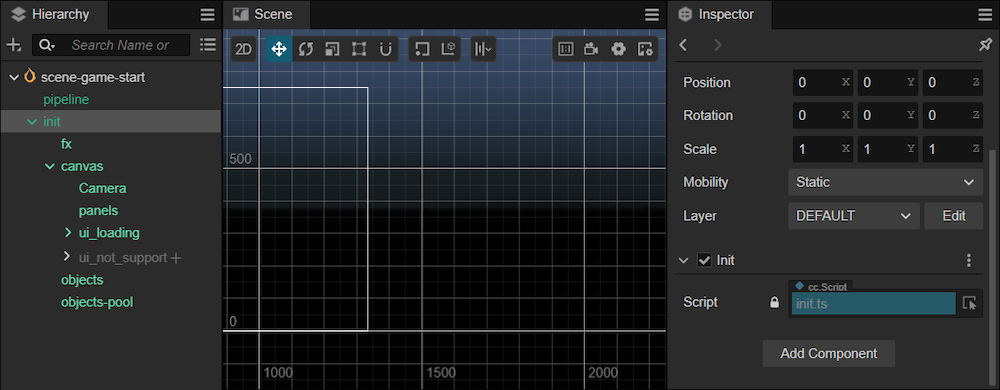

As shown above, you can see a node named "init", which has children named "fx", "canvas", "objects-pool" etc.

You can see there is a component named "Init" attached on the "init" node, this is the entry of Cocos Cyberpunk.

Starting from the next article, Kylin(me) will provide an introduction to the source code related to game logic. Stay tuned.
