# Explanation of the Gameplay Framework

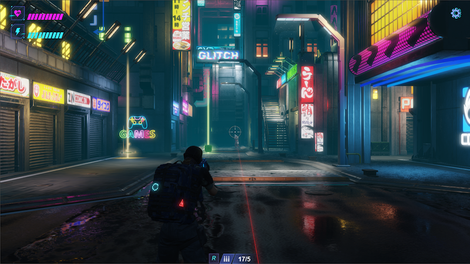

Cocos Cyberpunk is a complete open-source TPS 3D game developed by the official Cocos engine team to showcase the engine's capabilities for creating high-quality 3D games and to boost community learning motivation. It supports multi-platform publishing on Web, IOS, and Android.

This series of articles will provide an in-depth interpretation of the source code from various perspectives, enhancing everyone's learning efficiency. We hope it will help you advance further in the journey of 3D game development.

Free source code download page:[https://store.cocos.com/app/detail/4543](https://store.cocos.com/app/detail/4543)

Kylin(me) believes that this article can save you several days of research time.

Don't believe it? Keep reading!

## Table of Contents

Actually, this article didn't start like this. When it was almost finished, the person who is in charge of Cocos Cyberpunk gameplay told me that this part would continue to be adjusted.

Then I realized that explaining too many logic details would lose the reference value of this article as the version updates.

After understanding some of the future plans from the game team, I decided to start over and create a guide from the perspective of code-writing and logic mechanisms.

The contents is shown as below:

1. **Preloading**
2. **【Important】Data and Action**
3. **Game Module Guide**
4. **Level Module Guide**
5. **Actor Module Guide**
6. **Main Character Control**
7. **Character Animation Masking and IK**
8. **Monster Spawn Mechanism**
9. **Item Drop Mechanism**
10. ...

## Preloading

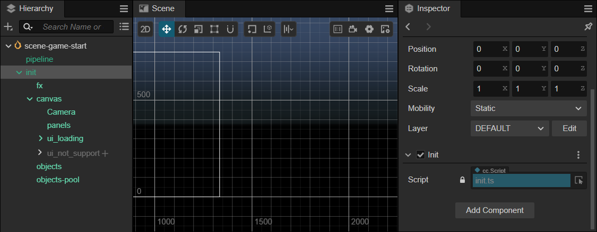

### Entry Script init.ts

The previous article briefly mentioned this entry script named `init.ts`. It checks if the device supports WEBGL adn give a prompt if it is not supported. It also sets the init node to be persistent to ensure the normal execution of the game logic.

Next, let's focus on the following initialization function:

```ts
...
// Load the resource cache data and execute the initialize game function.
ResCache.Instance.load(async () => {
    console.time('loadTextures')
    await loadTextures();
    console.timeEnd('loadTextures')
    Game.Instance.init();
});
...
```

As you can see, init.ts first calls ResCache.load for initialization, and after the initialization is complete, it executes the callback.

In the callback function, it call the `loadTextures` function to preload all textures in the `resources/textures/` folder.

Finally, it calls `Game.Instance.init` to start the game logic.

### ResCache

`ResCache` is a singleton class responsible for loading and caching the required resources.

In addition to providing `loadXXX` series methods, it also offers `getXXX` series methods, it allows all resources can be used directly after successfully preloaded.

In the `ResCache.load` function we can see, it first loads the `data/data-res-cache.json` file and the, preloads the corresponding json,sprite and sound files based on the configuration.

At the same time, it emits a `msg_loading` event.Due to the UILoading is listening to this event, it will display when the event is fired.

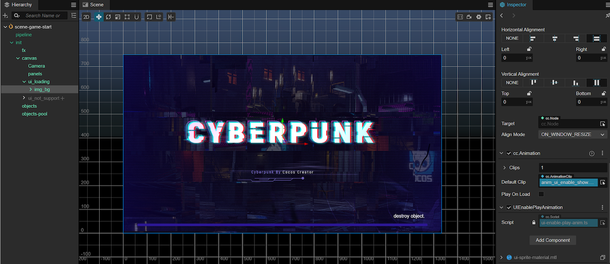

During the loading stage, `ResCache` also takes the responsibility of loading progress statistics. You can easily see this by checking where the `addLoad` and `removeLoad` methods are called.

When the resource preloading is complete, the scene will switch from `scene-game-start.scene` to the `scene.scene` and display `resources/ui/ui-logo.prefab`.

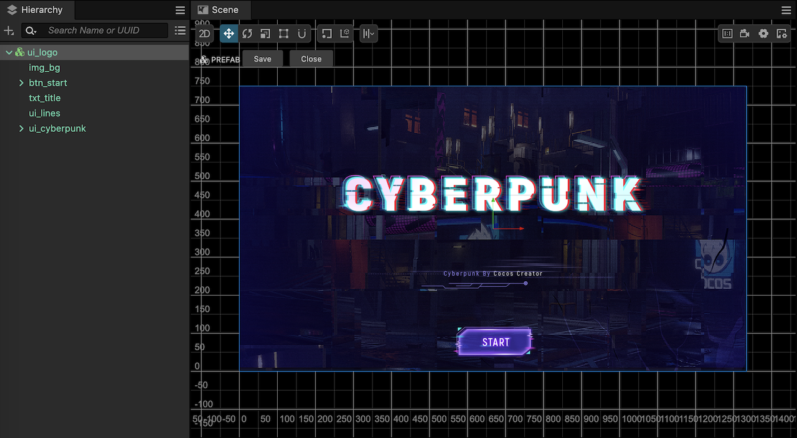

## < Important > Data 与 Action

Many friends may like me, have tried to find the relevant code for scene switching and UI display but haven't found it.

After consulting with the person in charge of gameplay, I suddenly realized: The entire game logic code refers to the node design mechanism of the behavior tree and is driven by data and actions.

In the game, the player is an object, the enemy is an object, and global managers such as game and level are also objects.

### Data

Each object has a data-xxx.json configuration file, which you can find in resources/data, such as:

- **game**: data-game.json
- **level**: data-level.json
- **player**: data-player.json
- **enemy**: data-enemy_1.json
- **boss**: data-boss_0.json

The data fields in these files correspond one-to-one with the classes used to parse them. For example:

- **game** -> game.ts
- **level** -> level.ts
- **player** -> actor.ts
- **enemy** -> actor.ts
- **boss** -> actor.ts

So, you will find that the content format of **data-player.json**, **data-enemy_1.json**, and **data-boss_0.json** is similar. However, there is significant difference from **data-game.json** and **data-level.json**

### Action

Each object has an action-xxx.json configuration file, which you can find in the `resources/action/folder/`, such as:

- **game**: action-game.json
- **level**: action-level.json
- **player**: action-player.json
- **enemy**: action-enemy_1.json
- **boss**: action-boss_0.json

Similar to **Data**, the content of **Action** configuration files is also related to the class that executes it, and similar classes will use a similar configuration format.

Each **Action** file defines as series of **Action Nodes**.

Objects can trigger different **Action Nodes** based on conditions.

Each **Action Node** has two commands: **start** and **end**.

The **start** command is executed when the **Action Node** is entered, and the **end** command is executed when the **Action Node** is exited.

And each **start** and **end** can execute multiple operations in sequence when executed.

The class used to parse the **action-xxx.json** files is in defined in the **action.ts** script.

Going into **action.ts**, we can see that the **Action** class has two main functions:

- **on**: Executes the **start** command
- **off**: Executes the **end** command

In **UtilAction**, all operations that **start** and **end** can perform are defined. For example:

- **on_ui/off_ui**: Open/Close UI
- **on_inst_pool**: Initialize the object pool
- **on_bgm**: Play background music
- **on_scene**: Switch scenes
- ...

Next, let's use the **game** object to explain the operation mechanism of **Data & Action**.

## Game Module

The **Game** module involves 3 main files:

- **data-game.json**
- **action-game.json**
- **game.ts**

First, let's take a look at the key content of the two json configurations files:

### data-game.json

```json
{
    ...
    "fps":60,
    "start_node":"logo",
    "action_data":"action-game",
    "version":"version:202302271037",
    "show_version":"V1.2",
    ...
    "res_ui_root":"ui/",
    ...
}
```

In the **data-game.json** file, we can see it defines many things, such as frame rate, version etc,

Here we should also pay attention to the values of **start_node** and **action_data**, which are the key data for game startup process.

- **action_data**: Used to specify the corresponding Action file
- **start_node**: Used to specify the default Action Node

### action-game.json

```json
{
    "logo": {
        "start": [ ... ],
        "end": [ ... ]
    },
    "level": {
        "start": [ ... ],
        "end": [ ... ]
    },
    ...
```

As you can see, the **action-game.json** defines many actions, the two most critical ones are listed below:

- **logo**: Used to show the Logo and start button
- **level**: Used for gameplay

### game.ts

In the `init` method of **game.ts**, we can see the following tow lines of code.

```ts
// Initialize the game data.
this._data = dataCore.DataGameInst._data;
// Initialize game action data.
this._action = new Action(this._data.action_data);
...
// Push the game initial node into the stack data.
this.push(this._data['start_node']);
```

The first line of code gets the configuration data loaded from **data-game.json**.

The second line of code creates an `Action` using **action_data** (value is **action-game.json**)

The third line of code uses **start_node** (value is **logo**) as the initial action for the game.

Next, let's take a closer look at the specific content of the **logo** node in **action-game.json**.

```json
{ "time": 0, "name": "on_ui", "data": "ui_logo" },
{ "time": 0.1, "name": "on_inst_pool", "data": "gun_tracer_pool"},
{ "time": 0.15, "name": "on_inst_pool", "data": "sfx_heart"},
{ "time": 0.2, "name": "on_inst_pool", "data": "random-fly-car"},
{ "time": 0.3, "name": "on_inst_pool", "data": "level_events"},
{ "time": 0.4, "name": "on_bgm", "data": "bgm_logo"},
{ "time": 0.5, "name": "on_scene", "data": "scene"}
```

The translated execution process is:

- Display ui_logo
- Initialize objects and put them in the object pool
- Play background music bgm_logo
- Switch scene

>**Tips**: The unit of `time` is seconds, used for frame-by-frame processing. If you want to process quickly, you can  fill in all 0.

By this point, the introduction to the **Game** module is over. With the explanations above, reading the code for the **Game** module should be much easier.

## Level Module

The **Level** module is responsible for controlling level-related states, and it does not have specific behaviors.

It is just a container that connects the protagonist,monsters,items,path-finding,saving and other functions together.

When the users click on the START button, the **level** Action in the **action-game.json** will be executed.

```ts
"level": {
    "start": [
        { "time": 0, "name": "on_bgm", "data": "bgm_level"},
        { "time": 0, "name": "on_ui", "data": "ui_fx" },
        { "time": 0, "name": "on_msg", "data": "msg_level_start" },
        { "time": 0.2, "name": "on_msg_str", "data": { "key":"msg_set_camera", "value": false } },
        { "time": 2, "name": "on_ui", "data": "ui_level" }
    ],
    ...
}
```

As you can see, the following actions are performed here:

- Play background music bgm_level
- Display UI ui_fx
- Send event msg_level_start
- Send msg_set_camera, false
- Display UI ui_level

The **Level** module also involves the following 3 main files:

- **data-level.json**
- **action-level.json**
- **level.ts**

### data-level.json

```ts
{
    "name":"Cyberpunk Scene",
    "total_time":300,
    "close_blood_fx": true,
    "each_rate_value":10000,
    "killed_to_score":100,
    "survival_time_to_score":10,
    "level_events":"level_events",
    "prefab_player":"player-tps",
    "prefab_enemy":"enemy-tps",
    "prefab_drop_item":"drop_item",
    "enemies":["enemy_0", "enemy_1", "enemy_2", "boss_0"],
    "fx_dead":"fx_dead_white",
    "score_level":[...],
    "items":[...],
    "probability_drop_enemy":{...},
    "probability_drop_items":{...},
    "cards":["life", "attack", "defense", "special"],
    "probability_drop_card":{...}
}
```

We can see that the data configuration file of **Level** module contains:

- Kill scores
- Re-spawn time
- prefab information
- monster information
- dropped item information
- score level
- ...

You can change the level data and gameplay by modifying these configurations.

### action-level.json

```ts
{
    "start":{...},
    "warning":{ ... },
    "end":{...}
}
```

The Action configuration file for the level, is relatively simple, with only **start** , **warning** and **end**.

```ts
"start":{
    "start":[
        { "time": 0.2, "name": "on_msg_str", "data": { "key":"level_do", "value":"addPlayer" } },
        { "time": 0.5, "name": "on_inst", "data": "level_events_enemy" },
        { "time": 0.6, "name": "on_inst", "data": "level_events_items" }, 
        { "time": 0.7, "name": "on_inst", "data": "level_events_card" }
    ]
},
```

In the **start** command, we can see that the following actions will be executed when the level is loaded.

- **on_msg_str**：level_do, addPlayer
- **on_inst**：level_events_enemy
- **on_inst**：level_events_items
- **on_inst**：level_events_card

### on_msg_str

From the **UtilAction** class in **actions.ts**, we can see that the method prototype for **on_msg_str** is:

```ts
  public static on_msg_str (data: key_type_string) {
      Msg.emit(data.key, data.value);
  }
```

It's not hard to see that its function is to emit an event with a parameter.

Next, let's see how these actions are executed in the script code.

```ts
{ "time": 0.2, "name": "on_msg_str", "data": { "key":"level_do", "value":"addPlayer" }
```

Here, it emits a **level_do** message with the parameter **addPlayer**.

Opening **level.ts**, we can see that the message is listened for in its **init** function:

```ts
Msg.on('level_do', this.do.bind(this));
```

The prototype of the **do** function in **level.ts** is as follows:

```ts
public do (fun: string) {
    this[fun]();
}
```

From this, we can see that the first action in **action-level.json** is actually calling the **addPlayer** function of **Level**.

### on_inst

From the **UtilAction** class in **action.ts**, we can see that the method prototype for **on_msg_str** is:

```ts
    public static on_inst (key: string, actor: Actor) {
        var asset = ResCache.Instance.getPrefab(key);
        var obj = Res.inst(asset, Level.Instance._objectNode);
        if (actor && actor._viewRoot) {
            obj.parent = actor._viewRoot!;
            obj.setPosition(0, 0, 0);
        }
    }
```

From the prototype above, we can see that the **on_inst** method is used to instantiate a specified object.

The specified object parameter is the name of the **prefab**.

- level_events_enemy
- level_events_items
- level_events_cards

All of them are prefabs，and the corresponding files are located in the **assets/resources/obj** folder.

During the preloading phase, **ResCache** will load all the **prefabs** in the folder and store them by their **prefab** names. When using them, you can simply query by the name.

For more details, please refer to the **loadPrefab**, **setPrefab** and **getPrefab** in the **ResCache** class.

## Actor Module

New let's talk about the most concerned topics: **Player Control**, **Monster Spawning**, and **Pickable Item Generation**.

But before discussing these topics, let's first take a look at the **Actor** module.

In the previous content, we mentioned that when you open **action-player.json**, **action-enemy_1.json**, and **action-boss_0.json** files, you will find that their content formats are quite similar. This is because the corresponding classes for **player**, **monster**, and **BOSS** are all **Actor**.

When you open the **data-player.json** or **data-enemy_1.json** files, you can see information such as **action configuration file name**, **sound effects**, **maximum HP**, and so on.

```ts
{
    "name":"actor-enemy_0",
    "action":"action-enemy_0",
    "sfx_walk_ground":"sfx_walk_ground",
    "sfx_walk_grass":"sfx_walk_grass",
    ...
    "strength": 100,
    "max_strength": 100,
    "max_hp":60,
    ...
}
```

When you open the corresponding **action-xxx.json**, you can see commands like **play**, **jump**, **dead**, **pickup**, etc.

And each command will execute the following commands:

- **on_call**：Call the specified function name of the current actor.
- **on_set**：Set the value of specified variable of the current actor.
- **on_anig**：Set the variable of the animation image of the current actor.
- **on_sfx**：Play sound effects.

You can view the specific function prototypes in the **Action.ts** file by yourself.

As you can see, the **Actor** handles all of the actions above.

## Player Control

### Initialize

The **prefab** used for the Player is located at the path **resources/obj/player-tps.prefab**, which is configured in **data-player.json**.

Let's continue with the **addPlayer** in **level.ts**.

```ts
public addPlayer () {
    //获得 player 的 prefab
    const prefab = ResCache.Instance.getPrefab(this._data.prefab_player);
    //通过 prefab 生成 player 实例
    const resPlayer = Res.inst(prefab, this._objectNode!, this._data.spawn_pos);
    // 获取 Actor 组件
    this._player = resPlayer.getComponent(Actor)!;
    // 标记这个 actor 为主角
    this._player.isPlayer = true;
    // 使用 data-player.json 初始化这个 actor
    this._player.init('data-player');
}
```

The above are the key steps in the **addPlayer** function. Next, let's continue to look at what the **this._player.init** code does.

The code first call the **ActorBase.init** to complete some basic initialize work, and then calls **Actor.initView**.

In the last step of **Actor.initView**, it calls the **play** Action to start the object.

In **action-player.json**, we can see the content of **play** as follows.

```ts
"play":{
    "start":[
        { "time": 1, "name": "on_call", "data": "onUpdate"},
        { "time": 1.5, "name": "on_inst_scene", "data": "actor_input"},
        { "time": 1.5, "name": "on_com", "data":"ActorStatistics"},
        { "time": 1.5, "name": "on_com", "data":"ActorSound"},
        { "time": 2, "name": "on_msg_str", "data": { "key":"msg_set_input_active", "value": true} }
    ]
},
```

It does the following things:

- Calls the **onUpdate** function
- Instantiates the **actor_input** object
- Adds **ActorStatistics** and **ActorSound** components to the player
- Sends the **msg_set_input_active** event to activate input module.

### User Input Module

```ts
{ "time": 1.5, "name": "on_inst_scene", "data": "actor_input"},
```

The above statement will generate the instance of **resources/obj/actor_input.prefab** and add it to the scene code.

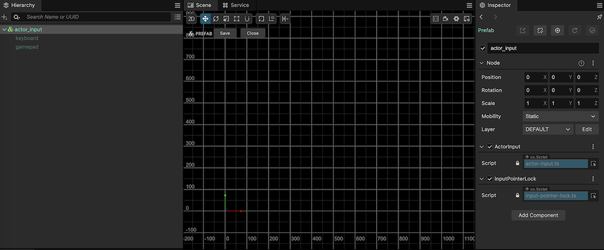

There is an **ActorInput** on the **actor_input.prefab**, which is responsible for handling user input.

Entering the **actor-input.ts** file, in the **initInput** of the **ActorInput** class, we can see that it performs platform detection. When the game is running on a mobile device, it will enable the **joystick** mode. Otherwise, it will use mouse and keyboard instead.

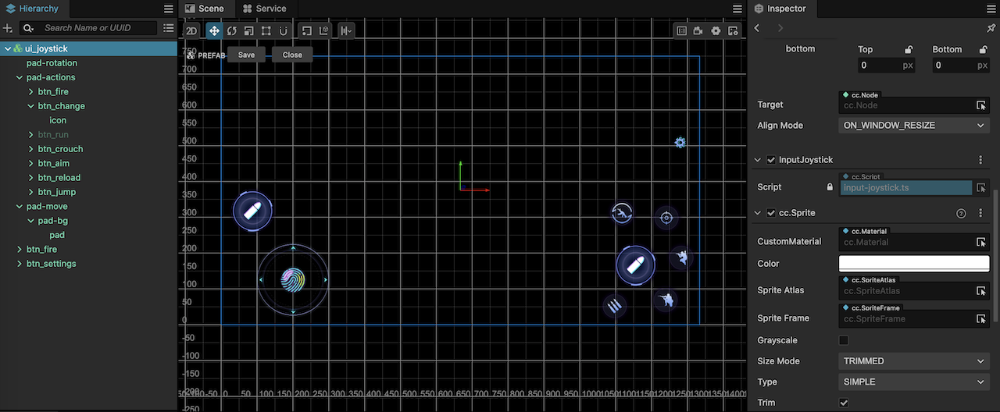

The **input-joystick.ts** and **input-keyboard.ts** don't directly control the character, but instead pass all control commands to the **ActorInput** component for processing.

**ActorInput** implements all user actions, such as **onMove**, **onJump**, **onRotation**, **onRun** etc.

### Player Camera

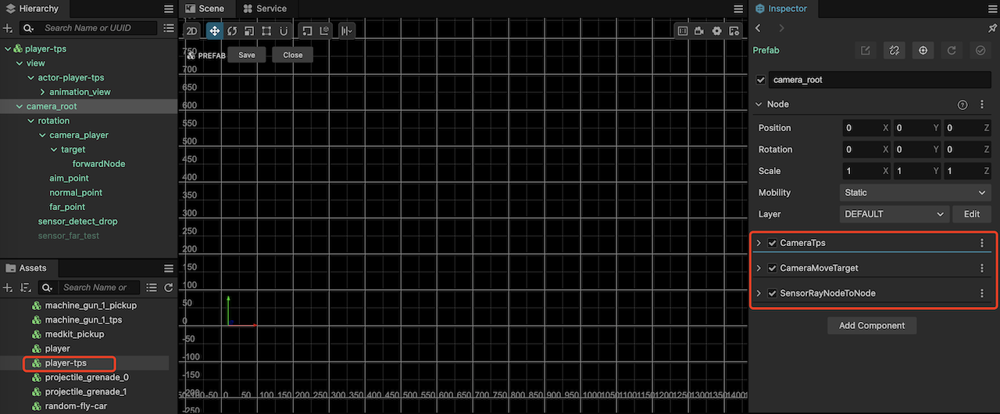

In **player-tps.prefab**, we can find the **camera-root** node, which has three components attached:

**CameraTps**：Used to control the camera's pitch. Since the camera's forward direction is always aligned with the main character, there is no need to control left and right.

**CameraMoveTarget**：Used to control the camera's tween effect.

**SensorRayNodeToNode**：Used for collision detection between the camera and the scene.

## Character Animation Mask & IK

In shooting games, there are two main features:

- **Shooting while moving**
- **Changing gun posture based on the camera direction**

The above features are also implemented in **Cocos Cyberpunk**.

### Character Animation Mask

**Cocos Creator** provides the features of animation graph, layered animation and animation mask.

**Layered Animation**：In simple words, users can play multiple animation at the same time and blend them using weights.

**Animation Mask**：Used to indicate which bones should be used for skinning when the animation is played.

In **Cocos Cyberpunk**, the character（both Player and enemy）animation graph has two layers: **base** and **fire**.
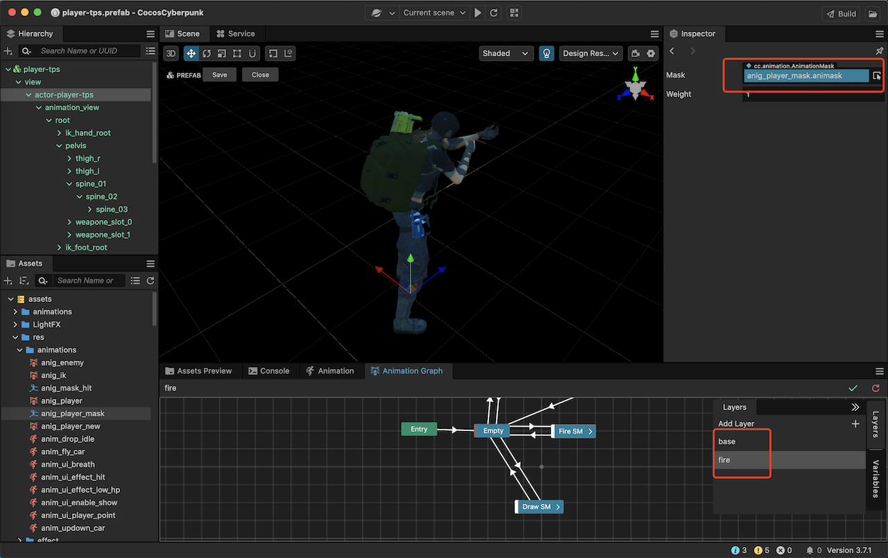

As you can see, the weight of **fire** is 1.0. Since the **fire** layer has a higher priority in the layer graph index, when **base** and **fire** are played at the same time, the **fire** layer will replace the animation.

If we want to implement the feature of shooting while moving, we hope that the **base** layer plays "move" and the **fire** layer plays "shoot". In addition, the **fire** layer should only affect the upper body.

At this point, we need to use the Animation Mask.

Double-click to open the  **anig_player_mask**, and you can see that all upper body bones has been selected. In other words, when the **fire** action is being played, only the upper body will be affected.

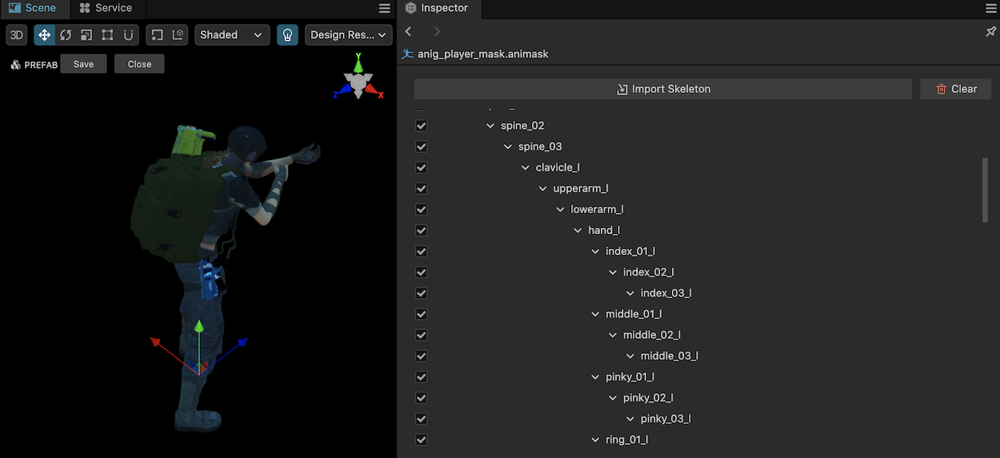

### Character IK

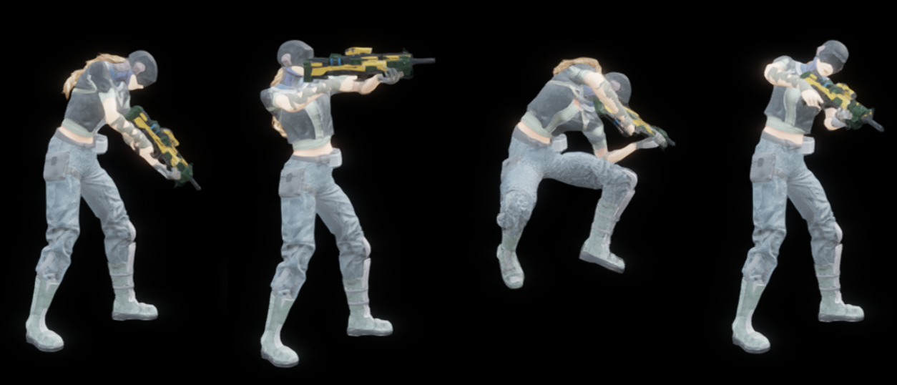

As shown above, we need to change th gun posture based on the direction of camera to ensure a good shooting experience in the game.

This is where the **IK** comes to play.

In **player-tps.prefab**, find the node named **actor-player-tps**, and you can see that it was tow components attached.

**AimIK**：Used for binding IK-related data. The aiming posture of the gun is mainly affected by the three joints on the spine: **spine01**, **spine02** and **spine03**. The component references them.

**AimControl**：Used for implementing aiming control.

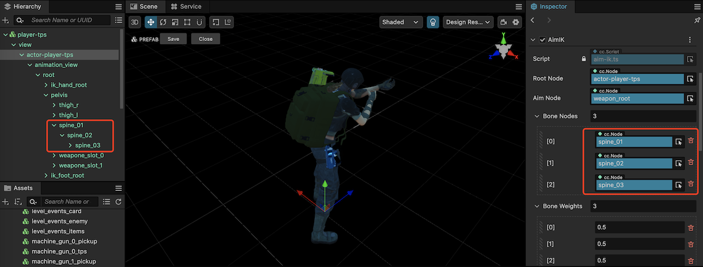

The **IK** related code can be found in the **scripts/core/ik** folder, Interested friends can study it in depth.

## Enemy Spawn

### Configuration

Let's start with the **start** Action in  **action-level.json**.

```ts
{ "time": 0.5, "name": "on_inst", "data": "level_events_enemy" },
```

When the **Level** starts, it will create an instance of **level_events_enemy**. There is only one in the level, and it is responsible for managing the spawning and destruction of enemies.

Resources related to it:

- **resources/obj/level_events_enemy.prefab**
- **resources/obj/boss_0.prefab**
- **resources/obj/enemy_0.prefab**
- **resources/obj/enemy_1.prefab**
- **resources/obj/enemy_2.prefab**
- **level_events_enemy.ts**

Open **level_events_enemy.ts** and you can see that in **LevelEventsEnemy**, the **probability_drop_enemy** from **data-level.json** is used as the data source. The content is as follows.

```ts
"probability_drop_enemy":{
    "interval":[2, 4],
    "interval_weight_max":1,
    "life_time":[30, 40],
    "max": 4,
    "init_count":[7, 10],
    "weights":[0.4, 0.7, 0.9, 1],
    "weights_max":[4, 4, 4, 1],
    "weights_group":[ 0, 1, 2, 3]
},
```

As you can see, it defines the spawn interval, maximum number of enemies, and so on.

### Spawn

In **LevelEventsEnemy** class, the most important function is generateEvent, which checks if if is necessary to spawn enemies.

If the spawning conditions are met, it will randomly choose an appearance for the enemy from **data-level.json*'s enemies property, which is shown as below.

```ts
"enemies":["enemy_0", "enemy_1", "enemy_2", "boss_0"],
```

After obtaining the appearance, it will randomly choose a behavior group, combine the data and then emit a **msg_add_enemy** event.

```ts
const currentIndex = this.probability.weights_group[occurGroupIndex];
const res = DataLevelInst._data.enemies[currentIndex];
// Send add add enemy.
Msg.emit('msg_add_enemy', { res: res, groupID: occurGroupIndex })
```

One thing to be note is that when the boss appears, it will emit a **warning** event. (hmmm, I think maybe it is better to be put into **action-boss_0.json**)

```ts
  if (res == 'boss_0'){
      Msg.emit('level_action', 'warning');
  } 
```

Meanwhile, it will respond to **msg_remove_enemy** event, which is used to handle the case when enemies are removed.

Then, in **AddEnemy**, it will randomly select an available location from the navigation system and create a new enemy.

```ts
  // Get a random point from the navigation system
  const point = NavSystem.randomPoint();
  // Create enemy
  var enemy = ResPool.Instance.pop(data.res, point.position); 
  const actor = enemy.getComponent(Actor);
  // Initialize the data.       
  actor.init(`data-${data.res}`);
```

### Enemy AI

Open **boss_0.prefab** or **enemy_0.prefab**, you can find two AI-related components.

**ActorBrain**：

This is the real Enemy AI driver, it will take the certain action based on the surrounding environment.

**ActorInputBrain**：

This is an adapter that makes the Enemy AI can easily be transferred to **ActorInput**.

## Pickable Item Drop Mechanism

### Configuration

Similar to the **level_events_enemy**, after the **Level** is successfully loaded, a manager for pickable items will be generated.

```json
{ "time": 0.6, "name": "on_inst", "data": "level_events_items" }, 
```

Resources related to it.

- **resources/obj/level_events_items.prefab**
- **resources/obj/drop_item.prefab**
- **level_events_items.ts**
- **drop-item.ts**

In **level_events_enemy.ts**, it uses the **probability_drop_items** property in **data-level.json** as the configuration data.

```json
    "probability_drop_items":{
        "interval":[5, 30],
        "life_time":[30, 40],
        "max": 4,
        "interval_weight_max": 1,
        "init_count":[7, 10],
        "weights":[0, 0.125,0.25, 0.375,0.75,1],
        "weights_max":[1, 1, 1, 1,2,2],
        "weights_group":[0, 1,2, 3,4,5]
    },
```

As you can see, it is similar to enemy spawning and also has some configuration parameters.

### Drop

In **level_events_items.ts**, it does not handle the actual item drop. Instead, it listens to the **msg_add_item** event and adjusts its own data.

When it determines that a new item need to be generated, it emits the **msg_add_item**.

In **level.ts** , it listens for the event and call the **addDrop** method.

In the **addDrop** method, an instance of **drop_item.prefab** we be created.

### Pick

On the **sensor_detect_drop** node in **player-tps.prefab**, it has **SensorRays** and **ActorSensorDropItem** two components.

**SensorRays**：Regularly checks the objects around the main character and stores them in the **checkedNode**.

**ActorSensorDropItem**：Performs some judgments, updates the state, and saves checkedNode as pickedNode.

There is a **UIDisplayByState** component on the  **grp_take_info** node in  **ui_level.prefab**, it detects this state and displays the prompt "Press E to pick up".

When the item is picked up, the **onPicked** method of the **Actor** is called and the **picked** event is emitted.

The **DropItem** component on the **drop_item.prefab** responds to the **picked** event, destroys and recycles itself.

#### Auto Pick Up

A **CheckAutoPick** component is attached to the prefab of Player, the **player-tps.prefab**.

When on a mobile device, it will automatically call the **Actor**'s **onPicked** method.

## Final Words

>Due to the complexity of **UI System** and **Navigation System**, they weren't covered in this post. 

I hope this article can help the ones who want to learn 3D game development from the Cocos Cyberpunk's source code.

The gameplay of Cocos Cyberpunk took the team several months to complete, which is obviously not can be fully understood in just two days, it's even more impossible to fully explain it in just one article.

I hope more friends can learn from this project together, share their learning experiences and tutorials, and make the Cocos Cyberpunk open source project even better.

The next article will likely be about Custom  Pipelines, so stay tuned.

## Appendix 1：Class Names <---> File Names

In the **Cocos Cyberpunk** project, class names use the **UpperCameCase** naming convention, meaning the first letter of each word is capitalized.

The corresponding ts file uses **lowercase-words-separated-by-hyphens**. For example:

- **UILoading -> ui-loading.ts**
- **CameraController -> camera-controller.ts**

Knowing this naming convention will help you quickly locate the desired code.

## Appendix 2：Two Types of Singleton Writing

Observant readers may notice that there are two types of singleton writing in the Cocos Cyberpunk project.

One type is the traditional **Singleton** pattern, which is suitable for all object-oriented languages.

It can be accessed by using **ClassName.Instance**, such as:

- UI.Instance
- ResCache.Instance
- Level.Instance
- GameSet.Instance

The advantage of this approach is that it can be called at any time and will be initialized on the first call.

However, the disadvantage is that all classes will be directly referenced by different files. When the class name is modified or the file is moved, all related files will be affected.

The other type is suitable for languages that support global variables such as TS,JS,and C++, please refer to **data-core.ts**, here are some examples.

```ts
import { DataEquip } from "../../logic/data/data-equip";
import { DataSound } from "../../logic/data/data-sound";
import { DataCamera } from "./data-camera";
...

export const DataEquipInst = new DataEquip();
export const DataSoundInst = new DataSound();
export const DataCameraInst = new DataCamera();
...

export function Init () {
    //Init data.
    DataEquipInst.init('data-equips');
    DataSoundInst.init('data-sound');
    DataCameraInst.init('data-camera');
}
```

This approach is quite flexible in use.

You can use it like this:

```ts
import * as dataCore from "./data-core";
dataCore.DataEquipInst.foo();
```

Or like this:

```ts
import { DataEquipInst } from '../data/data-core';
DataEquipInst.foo();
```

The advantage of this approach is: All referencing files only depend on a single container file, making the impact of refactoring very small.

However, there are some minor drawbacks: Multiple developers may maintain the same container file simultaneously, and need to all the initialization function in a certain place.

Comparatively, I like the second one, which makes the code more maintainable.

>**Tips：** Actually, the second approach is not new, It is the same as holding various instance objects in static class. It is only due to the language features of TS, which can use global variables, that such a writing style is possible.
