# Use Custom Render Pipeline in your own project

This article will discuss the new feature of Cocos Creator, Custom Render Pipeline(CRP), and demonstrate how to apply the custom render pipeline already written in Cocos Cyberpunk to your own project.

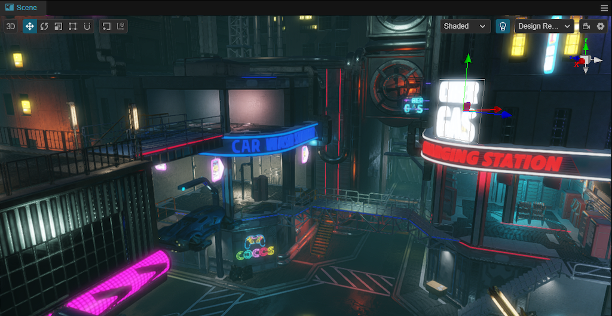

Cocos Cyberpunk is a complete open-source TPS 3D game developed by the Cocos Engine team to showcase the engine's capabilities of making heavy 3D games and boost community learning motivation. It can be published to multi-platforms, such as Web, iOS, and Android

This series of articles will provide an in-depth analysis of the source code from various perspectives to enhance the learning efficiency of learners. I hope to help everyone advance further in 3D game development.

Full source code can be got for free:
[https://store.cocos.com/app/detail/4543](https://store.cocos.com/app/detail/4543)

The amazing graphics in the Cocos Cyberpunk attracts many friends. Most of them are asking:

**How to apply the Custom Render Pipeline in Cocos Cyberpunk to my own project.**

This Article is specifically designed to satisfy this demand, mainly sharing the following points:

1. **CRP Graph**
2. **Forward Pipeline vs. Deferred Pipeline**
3. **Code Structure**
4. **Use Cocos Cyberpunk CRP in your own project**

>For ease of description, in the later articles, I will call Custom Render Pipeline as CRP.

Ok, without further ado, let's get started.

## Custom Render Pipeline - CRP

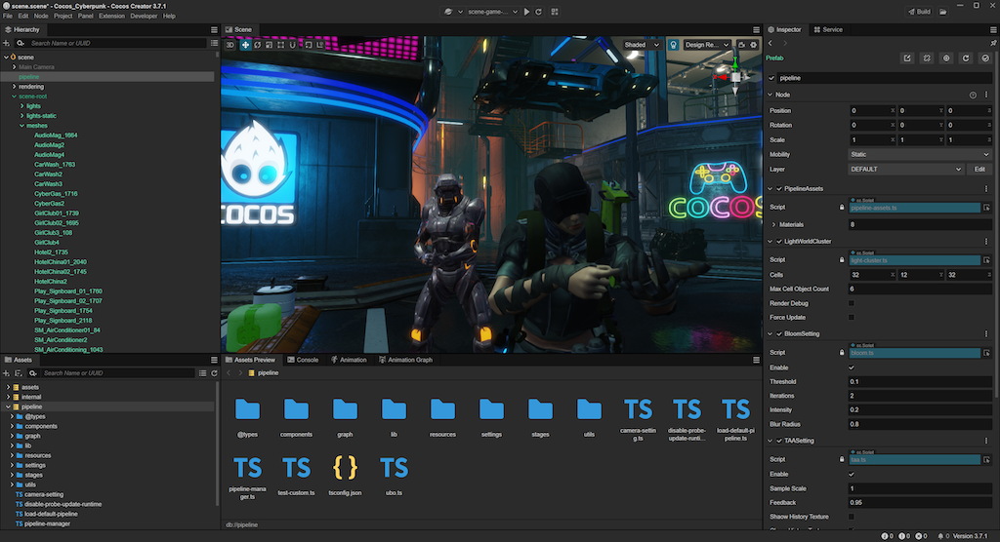

As the official heavy 3D game demo, Cocos Cyberpunk has undoubtedly put a lot of effort into rendering.

The most important feature here is the Custom Render Pipeline, CRP.

In the Cocos Cyberpunk, in order to achieve the target visual quality with the smallest performance overhead, the entire rendering processing of the Cocos Cyberpunk project is built based on CRP, implementing forward rendering pipeline, deferred rendering pipeline, and post-processing pipeline.

Moreover, it supports publishing to native and web platforms.

Whether it's used as a CRP template in your own project or as learning material for CRP, it's a great example.

Starting today, I will share my understanding of the rendering aspects of Cocos Cyberpunk, hoping to be helpful to everyone.

## CRP Graph

To have a comfortable start, let's begin with the simple and easy-to-understand parts.

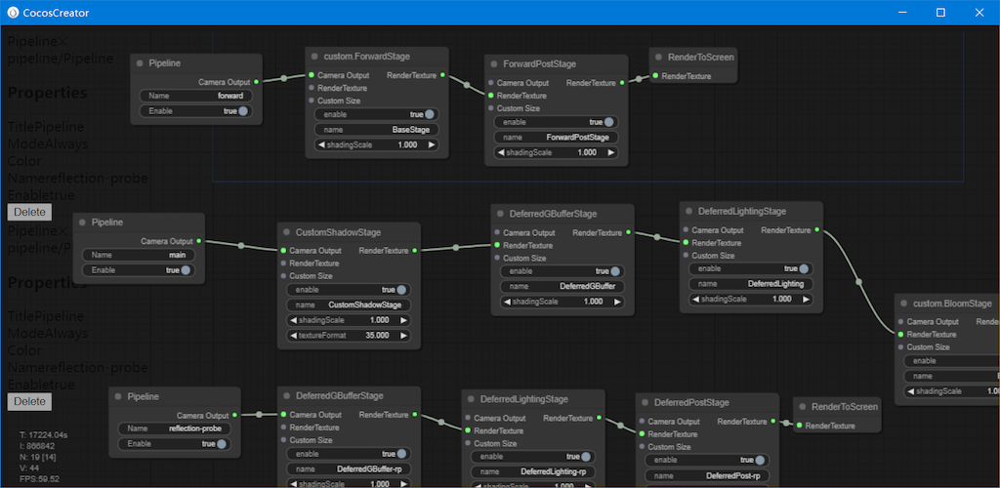

In Cocos Cyberpunk, to facilitate viewing the render pipeline process and status, the rendering expert implemented a visual Render Pipeline Graph, as shown above.

You can open this graph with the following three steps:

1. Create an empty node in the Hierarchy.
2. Drag **pipeline/graph/pipeline-graph.ts** component onto the node.
3. Check the **Edit** checkbox, and the Render Pipeline Graph window will pop up.
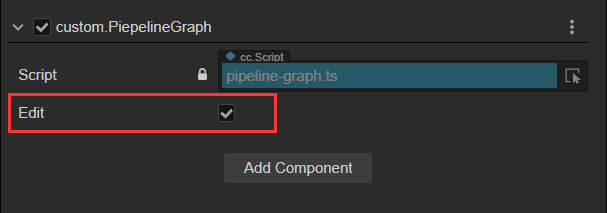

From the graph, we can see it implements three rendering pipelines: forward,main,and reflection probe.

The specific implementation details of each Pass in the pipeline will be explained one by one in later articles.

Today, let's take a look at the basic content of the three pipelines.

### forward pipeline

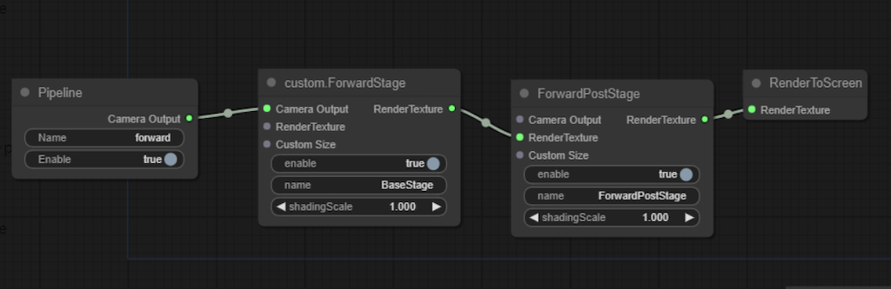

The **forward** pipeline is mainly used to render **UI** and 2D elements. It is very simple and has only two passes.

- **ForwardPass**：Used to render the scene
- **ForwardPostPass**：Used for the post-processing stage of the forward rendering pipeline
  
### main pipeline

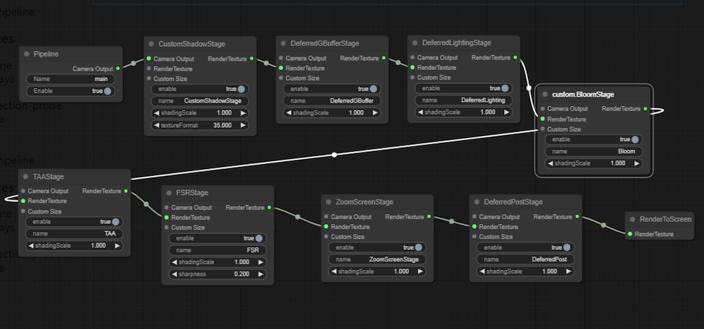

As the name says, this is the main pipeline of Cocos Cyberpunk, made up of 8 passes.

- **CustomShadowPass**：Used for shadow map
- **DeferredGBufferPass**： GBuffer stage in deferred rendering
- **DeferredLightingPass**：Lighting stage in deferred rendering
- **custom.BloomPass**：Bloom effect
- **TAAPass**：TAA anti-aliasing
- **FSRPass**：FidelityFX Super Resolution
- **ZoomScreenPass**：Screen scaling
- **DeferredPostPass**：Used for the post-processing in deferred rendering pipeline

### reflection probe pipeline

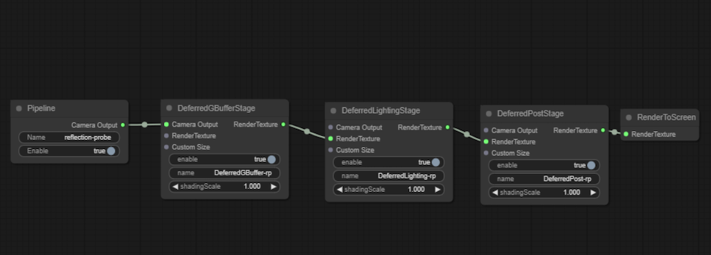

This pipeline was originally used for baking reflection probes, but now the baking system also uses the main pipeline when baking reflection probes, currently not in use. It includes three passes.

- **DeferredGBufferPass**
- **DeferredLightingPass**
- **DeferredPostPass**

## Pipeline Selection

Next, let's see how to decide which rendering pipeline to be used in Cocos Cyberpunk.

To better describe this, we need to distinguish between two types of cameras.

- **Runtime camera**：This is the camera created by ourselves in the Hierarchy, which is used to render nodes in the scene during project running.
- **Editor built-in camera**：This is the camera that comes with the editor and is used to render previews in the scene editor. It has a fixed name called **Editor Camera**。

In the **renderCamera** method of **pipeline/pipeline-manager.ts**, we can see the following code.

```ts
if (!pipelineName) {
    pipelineName = 'forward';
    if (cameraSetting) {
        pipelineName = cameraSetting.pipeline;
    }
    else if (camera.name === 'Editor Camera') {
        if (camera.projectionType === renderer.scene.CameraProjection.ORTHO) {
            pipelineName = 'forward';
        }
        else {
            pipelineName = 'main';
        }
    }
}
```

From the code above, we can notice:

1. When the runtime camera in the scene does not have a **CameraSetting** component attached, it will render objects using the **forward** method. Otherwise, it will render using the way specified by the **CameraSetting** component.

2. When the editor is rendering UI, the **forward** pipeline will be used, and in other cases, it will use the **main** pipeline to render objects. This is why you can see real-time Bloom/TAA effects in the scene editor.

Next, let's look at the 3 runtime cameras used in Cocos Cyberpunk.

### 1. UI Camera

Open the **scene-game-start** scene, locate the **init/canvas/Camera** node, which is used to render the UI.

You can see it has a **CameraSetting** component, with the value of  **Pipeline** property set to **forward**.

### Roaming Camera

Open the **scene.scene**, locate to **Main Camera/Camera**, and you can see it has a **CameraSetting** component with the value of **Pipeline** property set to **main**.

This camera is the one to roam the scene when the game begins.


### 3. Main Character Camera

Open **assets/resources/obj/player-tps.prefab**, locate to **player-tps/camera_root/camera_player**, and you can see it has a  **CameraSetting** component with the value of **Pipeline** property set to **main**.

This camera is attached to the main character and is used to control the game's perspective.

We can see, at runtime, the **forward** pipeline is used for UI, **main** pipeline is used for **3D** objects.

## Folder Contents and Code Structure


To help you get started easily, in this article, we'll first take a look at the code structure to help you quickly locate the content you want to see.

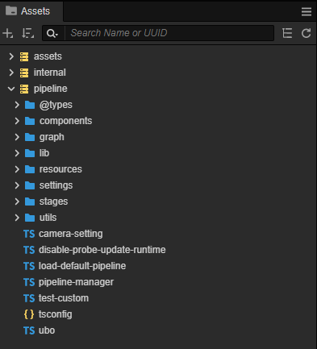

As I mentioned before, to facilitate reuse, the engineer responsible for the Cocos Cyberpunk rendering work has isolated the CRP-related content as extensions. In the **Assets** window, you can see three folders: assets, internal, and pipeline. The 'pipeline' folder is the target we will pay attention to.

### Folder Contents

The pipeline folder mainly contains the following:：

- **pipeline-manager.ts**：the entry file for CRP
- **components**：scripting components needed for CRP
- **graph**：CRP graph related content
- **lib**：Third-party libraries, currently using detect-gpu for checking GPU parameters
- **resources**：resources files( effects, materials , prefabs etc) needed for CRP
- **settings**：configurations
- **passes**：code of each pass in CRP
- **utils**：some utility classes, such as math, debug, event, and so on.

### Entry

A class named **CustomPipelineBuilder** has been defined in **pipeline-manager.ts**, which is our main entry.

At the bottom of the file, there are two important lines of code, as follows.

```ts
//register crp into engine renderer
if (director.root && director.root.device && director.root.device.gfxAPI !== gfx.API.WEBGL) {
    rendering.setCustomPipeline('Deferred', new CustomPipelineBuilder)
}

//set CC_PIPELINE_TYPE to deferred rendering
game.on(Game.EVENT_RENDERER_INITED, () => {
    director.root.pipeline.setMacroInt('CC_PIPELINE_TYPE', 1);
})
```

the prototype of rendering.setCustomPipeline is as follows.

```ts
setCustomPipeline(name: string, builder: PipelineBuilder): void;
```

Parameters

- name：the name of CRP
- builder：the instance of CRP

the prototype of PipelineBuilder is.

```ts
export interface PipelineBuilder {
    setup(cameras: renderer.scene.Camera[], pipeline: Pipeline): void;
}
```

It only requires the user to implement the `setup` method, which is called every frame during rendering. You can think of it as `render` method for easier understanding.

## Moving CRP to Your Own Project

Next, let's move on to the part that everyone is most interested in: **How to move the CRP from Cocos Cyberpunk to my own project.

### Move

#### Step 1. Choose an existing project or create a new one

Whether it's an existing project or a new one, it's better to use the Cocos Creator in the version used in Cocos Cyberpunk. Otherwise, some compatibility issues may occur.

#### Step 2. Copy the pipeline to your project

Find the extensions folder under the root of Cocos Cyberpunk project and copy the pipeline folder inside it to the extensions folder of your own project.

if your project doesn't have one, just create a new one.

#### Step 3. Enable the CRP

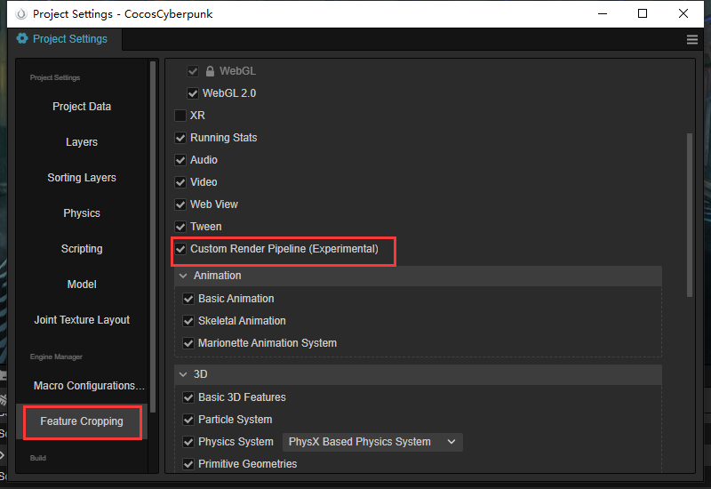

Find the menu **Project**->**Project Settings**, open the 'Project Setting' panel, select the 'Feature Cropping' tab, check **Custom Render Pipeline**.

Switch to **Macro Configurations** tab, and fill in **Deferred** at the **CUSTOM_PIPELINE_NAME**.

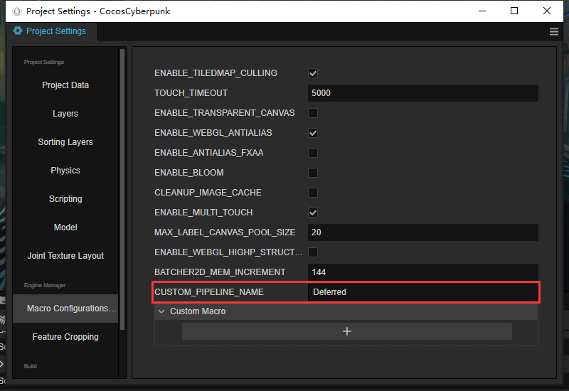
> The **Deferred** here, corresponds to the pipeline name registered in the **pipeline-manager.ts**. You can try to change the name to see what will happen.

#### Step 4 Restart Cocos Creator

It's quite simple, close Cocos Creator, and reopen the project in Cocos Dashboard again.

### Verification

Next, let's create a glow effect to verify if the CRP is working.

#### Step1. Create a new scene

First, create a new scene, then create a Plane and 2 cubes on the plane. So it's easy to observe.

#### Step 2 Create material

The CRP in **Cocos Cyberpunk** is a deep customization solution, the effect of the material must use **pipeline/resources/surface/custom-surface.effect**.

So, We need to create 3 new materials and assign the effect to them, then drag them to the plane and cubes.

#### Step 3 Adjust the materials

To make it easier to observe, we darken the **Albedo** of the **Plane** material, you can get the following effect.

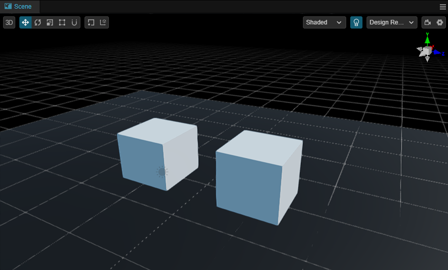

Next, let's change the **Emissive** color of one of the cubes' materials and increase the value of **Emissive Scale**, you will see it glows.

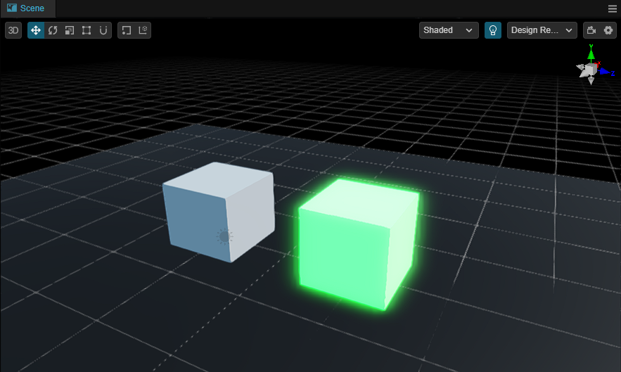

Preview in the browser, and you will see the same effect, which means the integration was successful.

Now, you can start taking a further step with the Cocos CRP on your own.

## Conclusion

In today's article, we provided a simple explanation of the Cocos CRP(Custom Render Pipeline) in Cocos Cyberpunk and demonstrated how to integrate it into your own projects.

In the coming articles, I will introduce the mechanism of Cocos CRP, and explain it by taking Cocos Cyberpunk as an example.

I hope this will help those who want to use Cocos CRP for their own projects or those who want to learn 3D graphics rendering via Cocos CRP.

That's all for today, Thank you for reading, and don't forget to follow me for more exciting content in the future.
