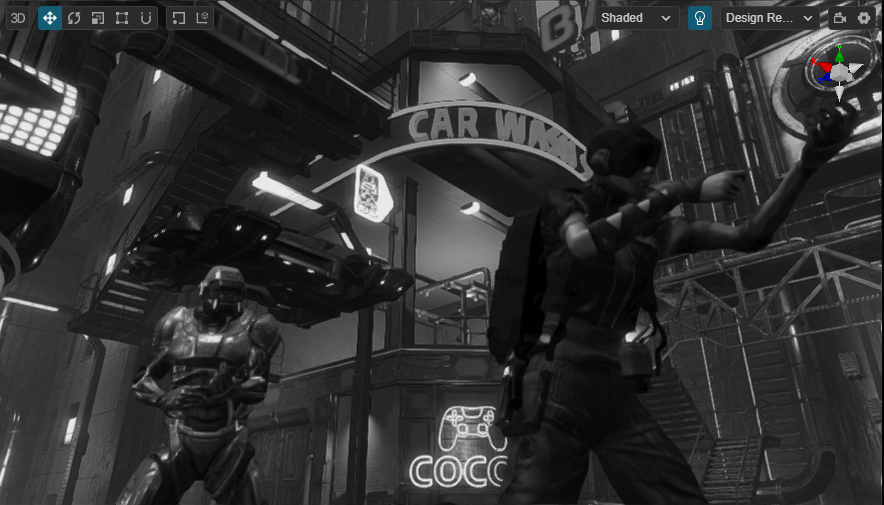
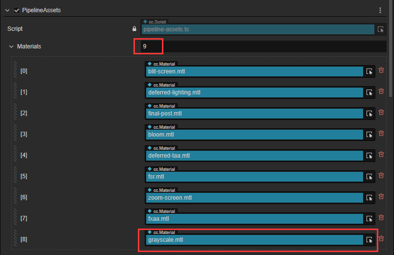
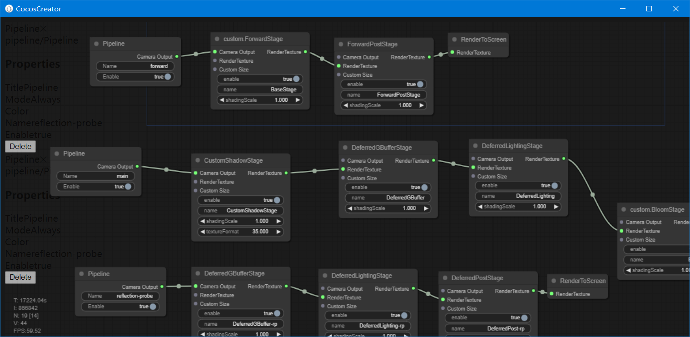
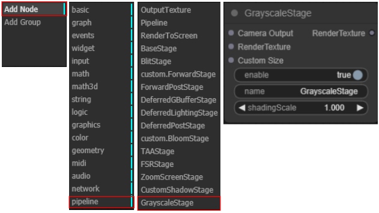
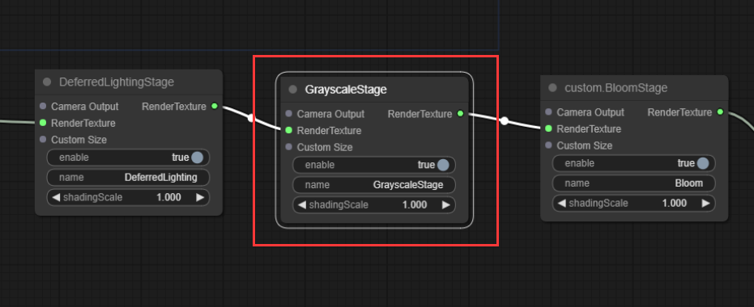

# Write a Post-Processing Shader using CRP Step-by-Step

In the previous article, I shared with you how to integrate the existing CRP solution from Cocos Cyberpunk into your own projects.

In this article, I will demonstrate how to add your own post-processing effect to the CRP solution.


Cocos Cyberpunk is a complete open-source TPS 3D game developed by the Cocos Engine official team to showcase the engine's capabilities in creating heavy 3D games and to boost the community's learning motivation. It can be released to multi-platforms, such as Web, iOS, and Android.

This series of articles will analyze the source code from various perspectives to improve your learning efficiency. I hope to help you advance further in 3D game development.

Download the project source code for free at：
[https://store.cocos.com/app/detail/4543](https://store.cocos.com/app/detail/4543)

Today's content is relatively simple, suitable for both juniors to explore and seniors for entertainment.

After integrating the CRP from Cocos Cyberpunk into their own projects, many friends got stuck on how to do the next. So they came and asked:

- **How do I add a new Shader for the CRP?**
- **How is the CRP graph connected?**
- **I want to add my own effect, how do I do it?**

Don't worry, I've got you covered!

As you can see, I always maintain a clear structure in my articles - an introduction, main content, and conclusion.

This structure is very suitable for sharing learning content.

If you have any better suggestions, please feel free to let me know, and I will adjust accordingly.

Without further ado, let's get started.

## Content Outline

To add a new post-processing effect to the CRP in Cocos Cyberpunk, you only need to address the following questions.

1. **What post-processing effect to add**
2. **How to write a Pass**
3. **How to add a Pass to the pipeline**

Let's tackle them one by one.

## Choose an Effect

Cocos Cyberpunk has already built-in two post-processing effects with more than 90% popularity: Bloom and TAA. If you want to add more, you could consider it.

- **Lut**
- **Vignette**
- **DoF**
- **Motion Blur**
- **SSR**
- **SSAO**

Except for LUT and Vignette, which are quite simple, the rest are challenging.

The list is just for your reference.

Let's back on track, The purpose of this article is to demonstrate the workflow of adding a post-processing effect, so there is no need to make it too complicated. We will implement a simple effect.

To make things easier, we can create an effect that turns the screen grayscale.

Although this effect is simple, it can be used as a screen grayscale effect when the player dies to enhance the game atmosphere.

Let's start with a preview image to keep the audience engaged!



## Write a Pass

### Folder Contents

First, let's look at the contents involved in a pass.

- **pipeline/passes**：Related scripts
- **pipeline/resources/effects**：Related shaders
- **pipeline/resources/materials**：Related materials

### Pass Code

Next, we'll ignore all principles and details for now, quickly implement a grayscale effect, and grasp the workflow.

接下来，我们先忽略所有原理和细节，快速实现一个变灰效果，从而掌握流程。

#### 1. Build from fxaa

Create a new TypeScript file named **grayscale-pass.ts**, and copy the contents from **fxaa.ts**.

#### 2. Modify the content

Modify the code related to the class name as follows(check line by line):

```ts
@ccclass('GrayscalePass')
export class GrayscalePass extends BasePass {
    _materialName = 'grayscale';
    ...
    @property({ override: true })
    name = 'GrayscalePass';
    
    @property({ override: true })
    outputNames = ['GrayscalePassColor'];
    ...
    render(camera: renderer.scene.Camera, ppl: rendering.Pipeline){
      ...
      passUtils.addRasterPass(width, height, 'post-process', `Camera_Grayscale_Pass${cameraID}`);
      ...
    }
}
```

Remove the following code:

```ts
...
checkEnable () {
    return super.checkEnable() && !!HrefSetting.fxaa;
}
...
_offset = new Vec2
texSize = new Vec4
...
material.setProperty('texSize', this.texSize.set(width, height, 0, 0))
```

Alright, we have completed our grayscale-pass.ts.

### Cocos Shader

Next, let's create a Shader to turn the screen grayscale.

For quick implementation, we will first copy **pipeline/resources/fxaa.effect** and rename it to **grayscale.effect**.

Change to 'main' function content to the following:

```glsl
void main () {
  vec4 color = texture(inputTex,v_uv);
  float Y = 0.2126 * color.r + 0.7152 * color.g + 0.0722 * color.b;
  fragColor = vec4(Y,Y,Y ,1.0);
}
```

To keep the shader code clean, let's remove the unused parts and only keep the following.

```glsl
#include <unpack>
#include <./chunks/fxaa>
...
uniform Params {
  vec4 texSize;
};
```

Be careful not to delete **in vec2 v_uv;** by mistake, make sure to keep it.

Now, our shader is ready to use.

### Material

Creating the material is the easiest part. You just need to copy the  **pipeline/resources/fxaa.mtl** file in Cocos Creator and rename it to grayscale.

Then, set its effect to grayscale.effect.

Now, We are successfully created a GrayscalePass.

## Add The New Pass to CRP Graph

### Material Loading

1. Double-click **pipeline/resources/pipeline.prefab**.

2. In the Inspector panel, find out the **PipelineAssets** component.

3. Increase the number next to the **Materials** property( If you haven't changed it, it should be 8, we'll change it to 9), and you will see an empty element appear at the bottom.



4、Drag **pipeline/resources/materials/grayscale.mtl** into the empty element, then save **pipeline.prefab**.

The material will be loaded when the pipeline starts.

### Adding GrayscalePass to Graph Data

To be able to add nodes in the **CRP Graph**, we first need to register the **GrayscalePass** in the graph data.

Open **pipeline/graph/nodes/pass.ts**, and add the following line of code at the end:

```ts
createPassGraph(BasePass);
createPassGraph(BloomPass);
...
//GrayscalePass
createPassGraph(GrayscalePass);
```

### Adding the Node

~~Follow the steps I have mentioned previously.~~

Well, never mind, let's go through it from scratch.

#### Open CRP Graph

1. Create a new empty node
2. Drag the **pipeline/graph/pipeline-graph.ts** component onto this node
3. Check the **Edit** checkbox, it will pop up the **RenderPipeline Graph** window


You should see a window like this：


> If the CRP Graph window displays nothing, it's possible that the content of graph-data.ts has been lost. You can fix this issue by copying it from a backup of the Cocos Cyberpunk project.

#### Adding GrayscalePass

Right-click in the window to bring up the first-level menu, then choose the **AddNode** item.

In the new menu that pops up, select **pipeline** ( at the very bottom)

Next, in the new menu that appears, choose **GrayscalePass** ( at the bottom)

You'll now have a **GrayscalePass** node.


Place it in an appropriate position within the **main** pipeline, In this example, I placed it before the **BloomPass**.



Close this window and return to Cocos Creator editor, and you'll see the screen turning grayscale.


## Wrapping Up

That's all for today.

Although we didn't analyze the details and implementation principles of the pipeline, by learning from FXAA, we've implemented a post-processing effect that turns the screen grayscale.

This is called: standing on the shoulder of giants.

In the next article, we will explain the design of custom pipelines from a theoretical perspective.

The subsequent articles will cover explanations of forward pipelines, deferred pipelines, BLOOM, TAA, FSR, and more.

In the later articles, more advanced features will be added based on this pipeline, including but not limited to SSR, SSAO, SunShaft, etc.

Of course, many people are asking about native development-related features, and Cocos Cyberpunk has done a lot of optimizations and compatibility processing for the native platform. This content will be shared in future articles, so stay tuned.