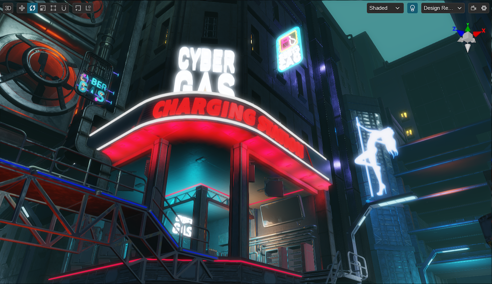
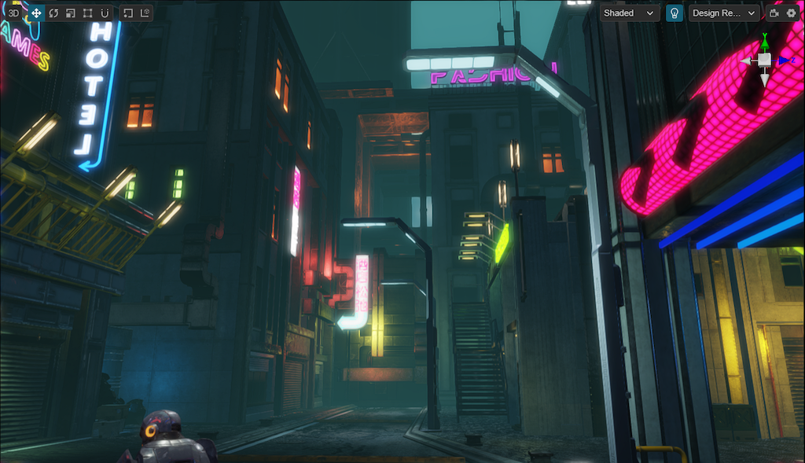
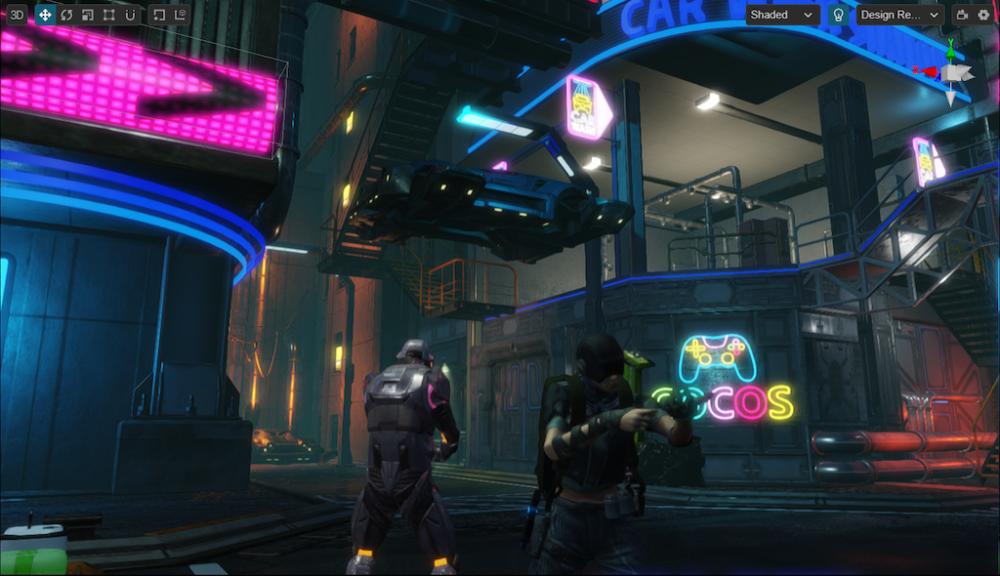
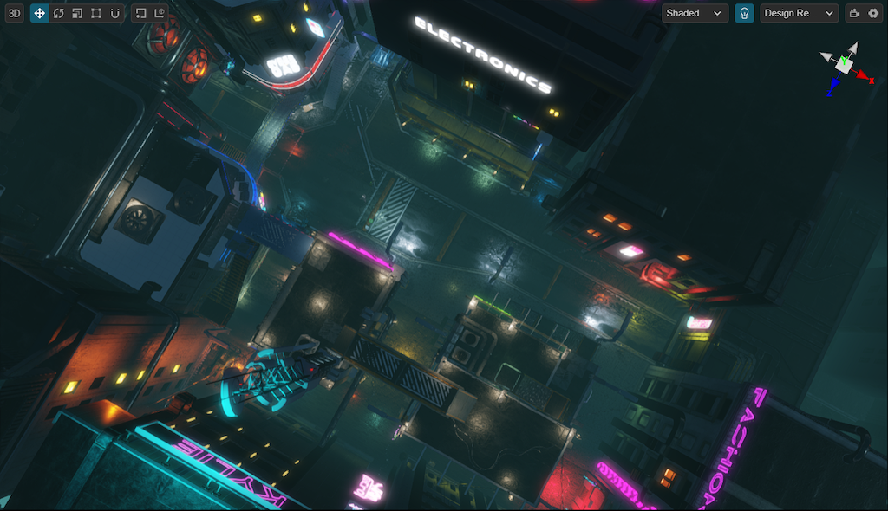
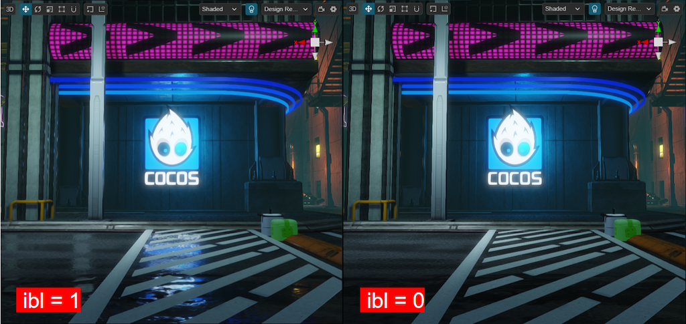
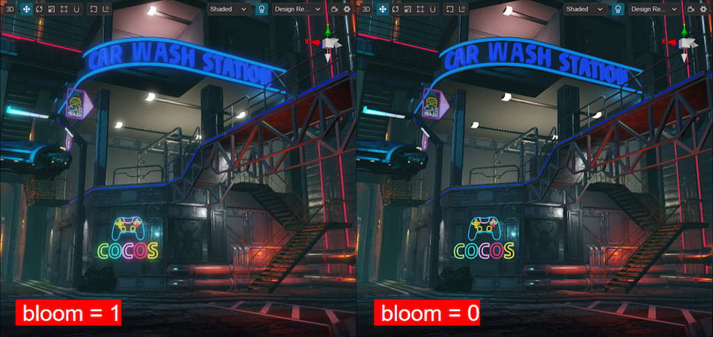
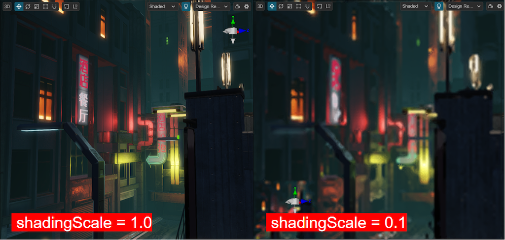
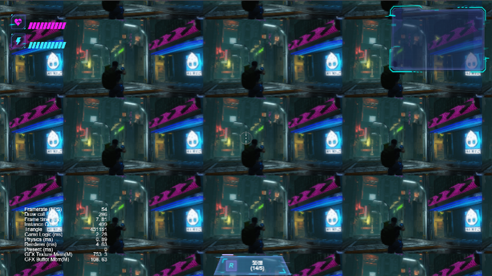
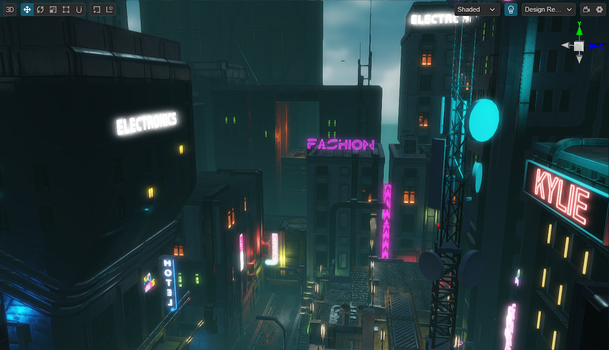

# Make your games run smoothly on high-end, mid-range, and low-end devices

When you've made an excellent 3D game, you definitely want it to run on more devices, not just high-end ones, as this would mean losing many users. In this article, I will share the methods I've learned from over a decade of 3D game development to make a game run smoothly on high-end, mid-range, and low-end devices.



Nowadays, we can see three common types of platforms: Native(iOS, Android, PC, Mac, Harmony, etc), Mini Games(Wechat MiniGames, Tiktok Mini Games), and H5(PC Browsers, Mobile Browsers, Facebook Instant Games, Poki Games, etc).

Due to the differences among platforms, the game quality that different platforms can carry on will also vary greatly. Not to mention the differences among different performance levels of devices.

And **Cocos Creator** benefits from its advantage of dual-core engine architecture (one core is for Native platforms written in C++, and another is for web platforms written in TS/JS), attracting many users for its multi-platform publishing capabilities.

So, developers often ask: How to make my project run smoothly on different devices and platforms?

Today, I will share how to make it and use **Cocos Cyberpunk** as a case study.

Cocos Cyberpunk is a complete open-source TPS 3D game developed by the Cocos Engine official team to showcase the engine's capabilities in creating heavy 3D games and to boost the community's learning motivation. It can be released to multi-platforms, such as Web, iOS, and Android.

This series of articles will analyze the source code from various perspectives to improve your learning efficiency. I hope to help you advance further in 3D game development.

Download the project source code for free at：
[https://store.cocos.com/app/detail/4543](https://store.cocos.com/app/detail/4543)

## Preface

>As one of the core skills of a lead programmer in large projects, I recommend those who have not yet mastered it to catch up quickly.

I have actually wanted to write about this topic for a long time, but to clarify this topic, it's not enough to just talk about it. a suitable large-scale project is needed for this demonstration.

When I heard that the Cocos Cyberpunk team said that Cocos Cyberpunk could run at 30 frames per second on Xiaomi 6, I knew that the opportunity to share this topic had come.

**Thanks to the Cocos Cyberpunk team, I can finally share this content.**

## Main Content



Some problems seem complicated, but as long as you see through the essence of things, they will be easy to solve.

The main idea is actually: **How to make your games run smoothly on platforms and devices with different computing power while retaining as much graphics quality as possible**

For running smoothly on low-end devices, performance should be prioritized, followed by graphics quality. This is a trade-off, if you take something, you have to give something up.

**So how do we do it?**

I have dealt with more than 10 different types of projects on this topic in my career, and it all comes down to two steps: **classify** and **process**. It is often called **Performance Scaling** or **Performance Adaptation**. You may also hear someone call it **Platform Optimization** or **Device Optimization**, but don't be confused, they are referring to the same thing.


The above words may have seemed too abstract, let's get straight to the point, the main content of this article.

- **Target Devices**
- **Device Classification Scheme**
- **Performance scaling Strategy**
- **Strategies implemented in Cocos Cyberpunk**

## Target Devices



According to my knowledge, there are roughly 3 types of target devices options based on the projects' needs.

### 1. Targeting High-end devices

These projects pursue high quality and typically have larger project sizes, complex gameplay, and refined graphics.

### 2. Targeting Mid-range devices

These projects are generally normal, with average gameplay and graphics.

### 3. Targeting Low-end devices

These projects aim for device coverage, trying to cover as many devices as possible. Most games with innovative gameplay belong to this type and care little about graphics.

**All three strategies have obvious shortcomings**

- If only targeting high-end devices, it's difficult to cover players using mid-range and low-end devices, leading to a limitation in revenue.
- If only targeting mid-range devices, it's difficult to cover players using low-end devices, and the gameplay and graphics are not satisfying for players with high-end devices.
- If only targeting low-end devices, the big advantage is having good device coverage. but if the game's creativity doesn't become a hit, it will be hard to attract players.

These make the task of adapting to multiple device performance levels particularly important.

If we focus on high-end devices, combined with **Performance Scaling** strategies, we can solve the various problems mentioned above.

Here comes a new question: **Which year's high-end devices should be the target*?**

**The target devices should be the ones that are on the market at the time when your game is released**.

For example, if your project is started today and is expected to be  developed for one year, you should use the high-end devices released a year later. Because the high-end devices released this year will be the mid-range devices in the next year.

We should remember: **For all the things that haven't happened, consider the changes that may occur over time, and don't measure them with the current data.**

## Device Classification scheme



As mentioned before, we should:**classify** first, then **process**.

### Performance Levels of Devices

Based on the computing power of devices, we can divide them into several levels. Typically, we can divide them into 3 or 4 levels if you need. but it's not recommended to divide them more.

Let's take 3 as an example.

#### 1. High-end

High-end devices are generally the premium series products released by major manufacturers at the time the game goes live.

It would be the most time-consuming part to make sure games run smoothly on the high-end devices, as after a year, the high-end devices will become mid-range. Taking full advantage of high-end devices can extend the game's lifespan as much as possible.

The main requirement for high-end devices is: running smoothly with all effects enabled.

#### 2. Mid-range

Mid-range devices are generally the premium series released about 3 years prior to the game release date.

Optimization for mid-range devices is more about balance. The main purpose is to ensure running smoothly while maintaining the best possible quality.

Since the mid-range devices can be obtained during development, optimization work for these devices can be done in advance, allowing for longer testing time to make sure that it works well.

#### 3. Low-end

The low-end devices are generally the premium series released about 6 years prior to the game release date.

Optimization for low-end devices only needs to consider performance. Just make sure the game runs smoothly on those devices, and any unnecessary feature can be turned off.  

### Classification

#### Apple Devices

Classifying Apple devices is so simple. All you need to do is place all the devices released by Apple Inc. into a table and mark them at certain levels.

#### Other Devices

For devices with **Harmony**, **Android**, **Windows**, or other operating systems. Because there are so many manufacturers and brands, it can't be done by filling the devices into a table.

Is there anything that can be listed in a table?

Of course, the chips.

Although there are so many device manufacturers, brands, and systems worldwide, there are only a few chip manufacturers, and the number of chip versions released each year is not that many.

Thus, for these devices, our scheme is as follows.

1. Fill in the common chips in a table and indicate the corresponding levels.
2. Detect the chip information when the game starts.
3. Determine the level of devices based on the chips they use.

> Apple devices can also be handled in this way.

#### Whitelist

No matter how hard we try, there are still some things that cannot be classified.

For example, when I was optimizing a game project several years ago. Device A and device B had the same chip, but the actual performance level of device A is high-end, while that of device B could only reach mid-range.

In this case, a whitelist is needed. The devices in the whitelist will directly use the pre-configured level.

#### Unknown Devices

In this vast world, there are always devices you haven't seen before. In this case, just treat them all as low-end devices.

> You can keep a **Quality Schemes** functionality in your game, allowing users to switch among high-end, mid-range, and low-end quality levels. This is useful when encountering unknown devices or when users have personal preferences, as they can decide the quality levels by themselves.

## Performance Scaling Strategy


### Performance Scaling vs. Performance Optimization

Performance scaling only does one thing: turning off some features until the frame rate meets the requirements.

However, the visual effects of different levels are preset. For low-end devices, all effects can be turned off for a smooth user experience ( at 24 ~ 30 fps ). For mid-range devices, some effects must be retained, otherwise, it is difficult to guarantee the quality and user needs.

Therefore, performance optimization is needed when the following situations occur.

1. A certain effect must be retained on mid-range devices.
2. Even after disabling all the possible effects, the frame rate on low-end devices still can't meet the requirements.

Since this article mainly discusses performance scaling, we won't delve into performance optimization.

Performance optimization is a vast topic that involves various aspects and the project itself. I have shared some articles about performance optimization of 3d rendering before. Friends who are interested in them can look back on those, we won't expand on that there.

### Commonly Used Manners

The core idea of all is: **Reduce unnecessary computing. Turn off as many details as possible without affecting gameplay.**

Generally, rendering is the main cost of the game's performance and does not affect the gameplay. So, it's recommended to start with rendering for device performance scaling.

#### 1. Details of Content

Whether it's a 3D or 2D game, scenes and characters can be composed of main elements and detail parts, especially scenes.

We can classify the level of details and disable them when needed.

For example, in a scene with grass and stones, you can display all the grass and stones on high-end devices, reduce some on mid-range devices, and display even fewer or none at all on low-end devices.

#### 2. Level of Effects

Whether it's in a 3D or 2D game, an effect can be composed of different elements. You can classify these elements by level, then disable more details on lower performance devices.

This not only retains the presence of effects but also improves the performance.

For instance, a flame effect consists of 3 emitters. We can display all emitters on high-end devices, display 2 emitters on mid-range devices, and display only 1 emitter on low-end devices.

Effects on low-end devices are rough, but it's still better than nothing.

#### 3.Rendering Resolution

Whether it's a 3D or 2D game, the rendering resolution has the same impact on game performance. So, on low-end devices you can consider limiting the rendering resolution to improve performance.

For example, many phones now use high-resolution screens, with DPR reaching 2 or 3. If it's detected as a low-end device, you can limit the maximum DPR value to 1.5 or less, so the memory usage of the framebuffer will be much less.

If you don't know how to limit DPR, the simplest approach is to render the scene to a RenderTexture. The size of RenderTexture is entirely under your control.

#### 4.Clipping Distance

**2D** games are unlikely to use this, but for some 3D games with adjustable views, you can reduce the rendering burden and improve performance by shortening the clipping distance.

#### 5.Material LOD

The complexity of materials greatly impacts the computational burden of the GPU and also significantly affects performance. We can create different levels of materials for different devices. The most detailed materials can be used on high-end devices, the materials with reduced details on mid-range devices, and the most basic materials on low-end devices.

#### 6. Mesh LOD

In 3D games, when all the above work is done and the performance still not up to requirements, you can consider reducing mesh details.

Mesh LOD can be switched not only based on distance but also based on the performance level of devices.

For example, we can set it as that on low-end devices, we start from the 3rd level. In this way, the first and second levels won't be used, greatly reducing the rendering overhead of the meshes.

## Solution in Cocos Cyberpunk

Next, let's take a look at the performance scaling solution in **Cocos Cyberpunk**.

Most of the related source code can be found in the folder: **pipeline/settings/**.

### Default Configuration

In the Cocos Cyberpunk project, the code for handling performance scaling is located in **pipeline/settings/href-setting.ts**.

When you open it, you can see there is a **HrefSetting** object which defines all performance-related parameters that can be controlled.

```ts
export const HrefSetting = {
...
  shadingScale:1, //use to scale the size of rendering resolution
  bloom:0, // turn on/off Bloom
  fps:60, //FPS
  transparent:1, // whether to render transparent objects
  clusterLighting:1, //whether to use dynamic lights.
  ibl:1, // turn on/off IBL
  fsr:1, // turn on/off FSR
  taa:1, // turn on/off TAA
  fxaa:1 // turn on/off FXAA
  sceneParticles: 1 // turn on/off particle rendering
...
}
```

From the above parameters, we can see that they can be mainly classified  into three categories.

1. Rendering Resolution：**shadingScale**, **fsr**

2、Effects switche：**bloom**, **ibl**, **taa**, **fxaa**

3、Rendering Flags：**transparent**, **clusterLighting**, **sceneParticles**

You can directly modify the values of this configuration and then view the differences in the editor. Let's take a look at several sets of values.







### Debugging Parameters

Next, let's take a look at the following code.

```ts
if (!EDITOR) {
    let href = window && window.location && window.location.href;
    let settings = href.split('?')[1]
    if (settings) {
    ...
    }
}
```

This code is for debugging purposes, making it easy for everyone to quickly switch configurations during runtime.

Just add the corresponding parameters to the URL during preview, such as:

```ts
http://localhost:7456/?zoomScreen=1;
```

The above link is to view the effect when zoomScreen is set to 1. Click on start to enter game, and you will see the following effect.



### Obtaining GPU Level

Looking further down, you can see a function called **getGpuInfo**, which is responsible for obtaining the device's GPU parameters and putting them at a certain level.

getGpuInfo is defined in the gpu.ts file and mainly accomplishes two things.

#### 1. Getting the GPU parameters

Cocos Creator engine has a built-in method to obtain the GPU information: director.root.device.renderer.

It can run on all platforms supported by Cocos Creator.

#### 2. GPU Scoring

For GPU scoring, it's handled individually for mobile and PCs

For PCs, the **pipeline/lib/detect-gpu** library is used to detect the device and provide a score. While for mobile devices, the scores defined in **gpu-mobiles.ts** are used directly.

```ts
export const GpuMobiles = {
    "adreno": {
        "530": 272,
        ...
        "619l": 252
    },
    "immortalis": {
        "g715": 3535
    },
    "apple": {
        "a16": 3331,
        ...
        "a10": 300
    },
    "mali": {
        "g710": 2319,
        ...
        "g72": 183
    },
    "xclipse": {
        "920": 1906
    }
}
```

You can see, it defines scores for common mobile chips. When the device is not in the configuration table, it is treated as a low-end device by default.

### Performance scheme

In **href-setting.ts**, **mobileSettings** and **pcSettings** are defined.

You can see that there are 3 levels for mobile devices and 4 levels for PCs. Each level specifics a score and the effects that need to be disabled.

Each level is inherited from the previous one. Let's take **mobileSettings** as an example.

```ts
let mobileSettings = [
    {
        score: 2000,
        shadingScale: Math.min(1240 / game.canvas.width, 1),
        bloom: 0,
        fxaa: 0
    },
    {
        score: 1200,
        shadingScale: Math.min(1024 / game.canvas.width, 1),
    },
    {
        score: 500,
        fsr: 0,
        taa: 0,
        maxEnemies: 2,
        sceneParticles: 0
    }
]
```

On mobile devices, high-end devices have parameters like limiting the maximum rendering resolution to 1240, turning off bloom, and fxaa. The mid-range devices are the same as the high-end ones but will limit the maximum rendering resolution to 1024, the low-end level follows the same pattern.

### Platform Differences

In the last few lines of **href-setting.ts**, you can see.

```ts
if (sys.isMobile && !JSB) {
    // todo: mobile particle rendering issue
    HrefSetting.transparent = 0
}
```

Since **JSB** is used in the **Cocos Creator** for communication with native platforms, **!JSB** represents non-native platforms, i.e., mini-games and H5.

The above code means that on non-native platforms, transparent objects ( including particles ) are turned off.



## Conclusion

In this article, I spent a lot of space explaining the methods and principles of device performance scaling. This is because performance scaling requires a tailored approach based on the specific requirements of your project. Understanding the basic principles allows you to make better and more suitable solutions.

The device performance scaling solution in Cocos Cyberpunk can serve as a basic starting point. You can add more controllable parameters based on your own needs.

I hope this article can be helpful to everyone and allow you to take a big step forward on your self-improvement journey.
