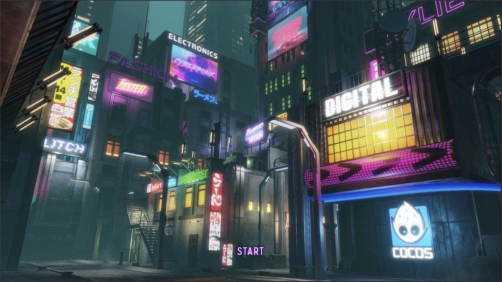
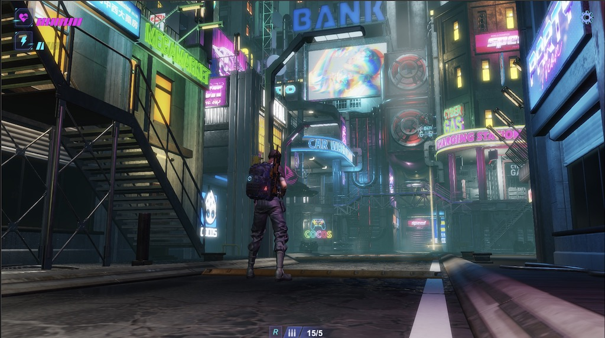
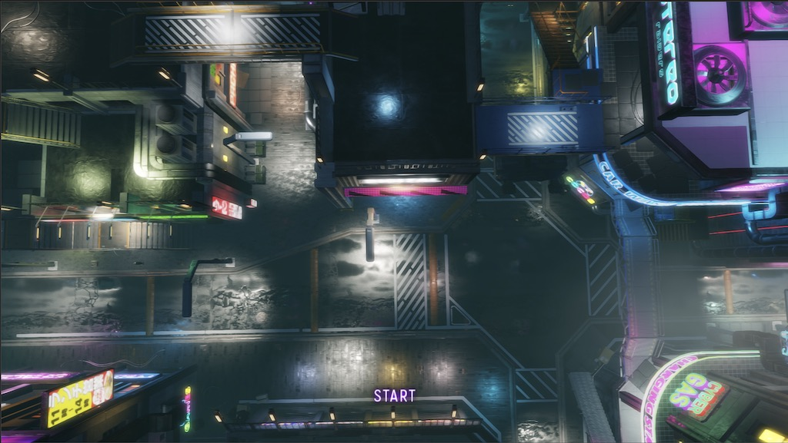
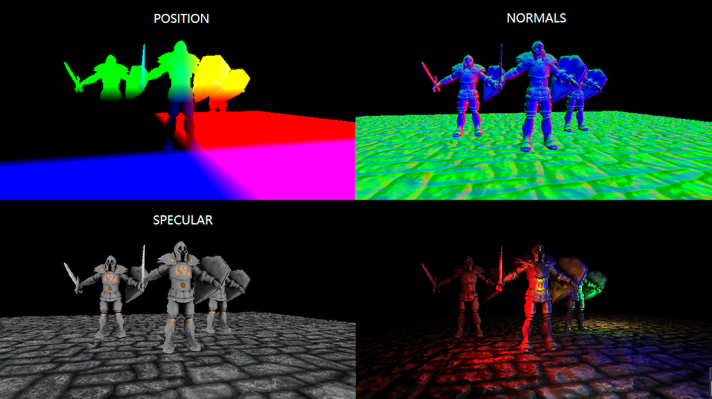
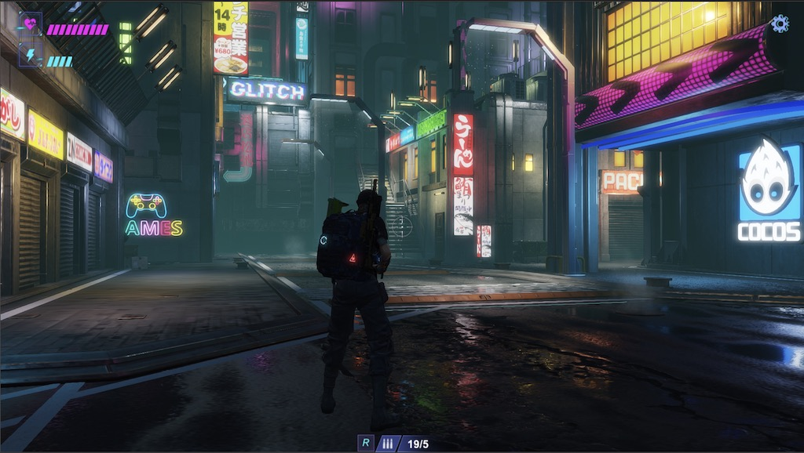
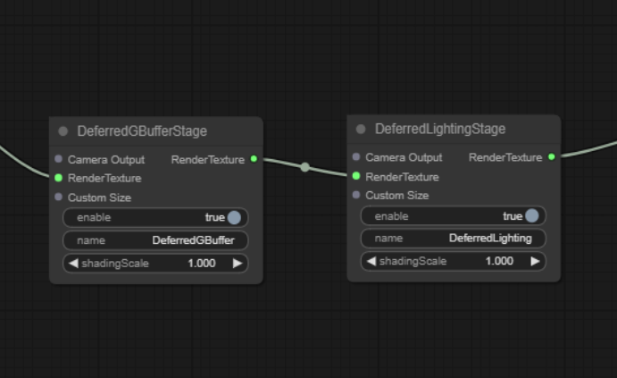

#



This article will delve into the principles, implementation details, common issues and solutions, memory overhead, and compatibility of the Deferred Rendering technique.

This series of articles will analyze the source code from various perspectives to improve your learning efficiency. I hope to help you advance further in 3D game development.

## Content

Although the Deferred Rendering technique was officially proposed at GDC in 2004, nearly 20 years have passed, and there are still many people who don't know the details, especially those who are new to 3D programming.

This article will concisely clarify several points below.

1. The rendering stages involved in Deferred Rendering.
2. The problems that are solved by Deferred Rendering.
3. A brief analysis of the principles of Deferred Rendering.
4. The implementation details of the Deferred Rendering pipeline in Cocos Cyberpunk
5. The memory usage, compatibility, and GPU hardware parameters related to Deferred Rendering.
6. Solution for transparent object rendering.

**To NEW Friends**： Cocos Cyberpunk is a complete open-source TPS 3D game developed by the Cocos Engine official team to showcase the engine's capabilities in creating heavy 3D games and to boost the community's learning motivation. It can be released to multi-platforms, such as Web, iOS, and Android.
Download the project source code for free at：
[https://store.cocos.com/app/detail/4543]

Many articles talk about the differences between Forward Rendering and Deferred Rendering on the Internet.
However, They all have several serious problems which make you feel like you've seen nothing.

1. Too academic, uses too many high-end words and is difficult to understand.
2. Not clearly explaining the working boundaries of Deferred Tendering, leads people to mistakenly think that Deferred Rendering can solve all problems.
3. Not combining practical cases, causing people to forget what they've learned quickly.

Today, I will attempt to explain it straightforwardly, combined with the source code of the Cocos Cyberpunk open-source project.



>Once again, thanks to the **Cocos Cyberpunk** development team, Without this open-source project, I wouldn't have an engineering-level case to share this topic.

## Involved Stages

To understand the principles of a technique, we need to understand the stages it participates in and why it exists.

This allows us to know its working boundaries and judge the appropriate scenarios to avoid misuse.

There are many articles about Deferred Rendering, but few of them mention the specific stages that Deferred Rendering involved.

**You may think Deferred Rendering can do everything, but in reality, it only participates in a small part.**

Next, let's take a look at the common 3D rendering processes in a 3D game engine: **Shadow Map Rendering** -> **3D Objects Rendering** -> **Screen Space Post-Processing** -> **2D Elements & UI Rendering**.

### 1. Shadow Map Rendering

In this stage, all objects in the scene are rendered with a unified material to generate shadow maps in the next stage of rendering.

### 2. 3D Objects Rendering

This stage is the main stage of rendering, where all 3D objects in the scene are rendered. It uses the shadow map to generate shadows, performs lighting calculations, and produces various looks. 3D objects in the scene can be divided into two categories: opaque and transparent, and they are handled differently.

### 3. Screen Space Post-Processing

In this stage, suitable image processing algorithms are used to apply special processing to the rendered scene, enhancing the graphics.

### 4. 2D/UI Rendering

Some 2D elements and UI elements are rendered in this stage.

The above stages are just the key stages in the standard rendering pipeline, some projects may add and delete processes according to their needs.

In such a long rendering pipeline, Deferred Rendering mainly targets the opaque objects in the 3D Objects Rendering Process.

The rest parts of the work in both Forward Rendering and Deferred Rendering Pipelines use almost the same set and do not have much difference.

Isn't it different from your thoughts?

To get the answer, let's see why in the next.

## Problems with Forward Rendering

> The following discussion focuses only on the 3D Objects Rendering Process, as Deferred Rendering only participates in this part.


In the scene above, there are the following elements:

- **10 Models（1 plane，9 cubes）**
- **7 lights（1 directional light，7 sphere lights）**

If using Forward Rendering, the process is as follows.

1. Get the data of a model, and submit it to the GPU for rendering.
2. In Vertex Shader, process vertex transformations, UVs, etc.
3. In Fragment Shader, perform lighting calculations with the 7 lights.
4. Process the next model.

We can easily see that the above process needs to be repeated 10 times ( as there are 10 models), and each model needs to perform lighting calculations 7 times.

So the total number of lighting calculations is 10 * 7 = 70.

There are mainly two problems with this.

### 1、Shader Instruction Limit

On some old devices, it can only support a certain number of lights. When the number of lights exceeds a certain value, multiple passes are required to complete the lighting calculations.  

### 2. Wasting GPU Computing Power

Lighting calculations are the most time-consuming part of rendering, especially for PBR material.

In the rending process above, some parts of the models are hidden by others but still participate in lighting calculations, resulting in waste.

Imagine how severe these two problems would be if the scene is large and contains many models and lights.

The emergence of Deferred Rendering just happens to solve these two problems.

Next, let's see why it is good at solving these two problems from the principle of Deferred Rendering.

## Brief Analysis of Deferred Rendering



### Two Main Steps

#### 1、Preparation（Geometry Rendering）

In this phase, the basic information needed for the lighting calculation of the model is rendered and stored in different render textures. For example, world space position, world normal, color, depth, etc.

#### 2、Calculation (Lighting)

The lighting phase uses the render textures rendered in the previous phase, combined with the lighting data in the scene, to calculate the final color of the model surfaces.

As we can see, in Deferred Rendering, the calculation of a pixel's color is uniformly performed in the lighting phase. which is where the term "Deferred" comes from.

Since the calculation is all done in the lighting phase, the pixels of the hidden parts of the models have already been discarded by depth testing, greatly avoiding unnecessary computations and thus improving performance.

### GBuffer



#### Definition of GBuffer

In Deferred Rendering, the most important concept is the: **GBuffer**.

GBuffer is short for Geometry Buffer, which means a buffer that stores geometry information. More specifically, it refers to a group of render textures used to describe object positions, normals, colors, and other information needed for lighting.

Thus, the **Preparation** phase mentioned above is also commonly called the **GBuffer** phase.

It's worth noting that Deferred Rendering is a concept, and there are many different implementations. What exactly is stored in the **GBuffer** is not standardized.

Engine developers implementing a Deferred Rendering Pipeline will choose suitable solutions according to their requirements.

#### GBuffer Content

To complete lighting processing, some basic information is essential, such as.

- **World space position**
- **World space normal**
- **Color**

But what else is needed?

Since the GBuffer mainly provides necessary information for lighting calculations, mastering the content of the GBuffer requires a basic understanding of lighting calculation concepts.

Lighting calculation is the focus of 3D graphics rendering. Most research on graphics rendering revolves around it and cannot be fully explained in just a few paragraphs.

However, for a better understanding of GBuffer, a conceptual understanding is sufficient.

Both **Blinn-Phong** and **PBR** follow the basic lighting formula.

**Final Color = Ambient + Diffuse + Specular + Emission**

The only difference is that the two use different data and methods for these four components.

**Ambient**: In Blinn-Phong, it is a constant, but in PBR, it is influenced by the material parameters.

**Diffuse**: Determined by the material and lighting data.

**Specular**: Determined by the material, lighting data and view direction.

**Emission**: Determined by the Emission-related parameters in the material.

In Blinn-Phong, the formulas used are very simple, mostly consisting of constants and simple vectors.

However, in PBR, the lighting formulas used are much more complex. For example, the **Cook-Torrance BRDF** math model is used to calculate the diffuse and specular of objects. Ambient is further divided into ambient diffuse reflection and ambient specular reflection, and IBL is used for processing.

In modern 3d engines(Such as Unreal Engine, Cocos Creator, etc), PBR materials have become the built-in materials. Therefore, the GBuffer in modern engines should at least include the following information:

**1、Ambient Occlusion - AO**

Used in the lighting phase to participate in the calculation of diffuse.
**2、Roughness/metallic**

There is more than one PBR model, for better understanding. Let's take the roughness/metallic model used in Cocos Creator as an example.

**3、Emission**

The emission is simply added in the lighting calculations. Its more significant function is to create the glow effect of objects, such as neon lights.

### Multiple Render Targets - MRT

As mentioned above, the GBuffer consists of a set of render textures that store information used for lighting. such as position, normal, color, PBR parameters, and so on.

So, how do we obtain all these render textures?

One simple method is to render the scene multiple times, with each outputting different content to the corresponding render texture.

However, this method sounds not usable. Rendering the scene multiple times means that the draw calls are multiplied, which increases the pressure on both the CPU and GPU.

This must to bring up a very important GPU feature: **Multiple Render Targets**.

Multiple Render Targets, or MRT, is the basis for the Deferred Rendering technique.

In the graphics pipeline, we collectively refer to the frame buffer and render textures as Render Targets.

In general rendering processes, whether we render the scene to the screen or to a texture, we only need to render to one render target.

But with the emergence of various rendering requirements, GPU gradually supports rendering to multiple render targets simultaneously.

With the support of multiple render targets, we can fill all the render textures in the GBuffer by rending the scene only once.

### GBuffer Compression

From the above description, we can see that in a Deferred Rendering pipeline based on PBR. In addition to the previously mentioned **AO**, **roughness**, **metallic**, and **emission**, the GBuffer must contain at least the following information.

- **position**: vec3, high precision, component range unpredictable
- **normal**: vec3, high precision, component range 0.0 ~ 1.0
- **color**: vec3, low precision, component range 0.0 ~ 1.0
- **AO**: float, range 0.0 ~ 1.0
- **roughness**:  float, range 0.0 ~ 1.0
- **metallic**:  float, range 0.0 ~ 1.0
- **emissive**: vec3, component range unpredictable
- **depth**：d24s8, range 0.0 ~ 1.0

Relying on the GPU feature, depth maps can be obtained directly without extra effort.

Even if we put the AO, roughness, and metallic into one single render texture, we still need 5 render textures (position, normal, color, PBR parameters, emissive ) to meet the requirements.

However, in the current graphics API standards, OpenGL ES 3.0 only stipulates that GL_MAX_COLOR_ATTACHMENTS should not be less than 4.

That means, on mobile devices, MRT greater than 4 would have compatibility issues.

So, we need to find a way to compress the data to 4 render textures.

Since normals can be normalized, knowing the two components of the normalized normal vector allows us to calculate the third component. As a result, normals only require two channels. Combining the value range of each data, after organizing, we can get the following GBuffer.

- **GBuffer_slot0**：RGBA8
  - xyz -> albedo.rgb
  - w -> no use

- **GBuffer_slot1**：RGBA16F
  - xy -> normal.xy
  - z -> roughness
  - w -> metallic

- **GBuffer_slot2**：RGBA16F
  - xyz -> emissive
  - w -> ao

- **GBuffer_slot3**：RGBA16F
  - xyz -> position.xyz
  - w -> no use

Of course, there is also a hidden GBuffer_slot4:D24S8, which is used for depth maps. However, it is a built-in feature of the depth buffer and does not occupy the number of MRT.

## Cocos Cyberpunk



As early as **Cocos Creator v3.1** version, the **Deferred Rendering Pipeline** was available for options.

In the **Cocos Cyberpunk** project, relying on the all-new Custom Render Pipeline capabilities of **Cocos Creator 3.7**, the team also implemented a specific Deferred Rendering Pipeline tailored to the project's needs.

Next, I will demonstrate the implementation details of an actual deferred rendering pipeline in terms of pipeline flow, GBuffer construction and filling, and lighting calculations, combined with the Cocos Cyberpunk source code.

> The full code of Cocos Cyberpunk can be got for free from: [https://store.cocos.com/app/detail/4543](https://store.cocos.com/app/detail/4543).

Following the method described in the previous articles, open the Custom Render Pipeline Graph window, and you can find the DeferredBufferPass and DeferredLightingPass in the main pipeline.



### GBuffer Construction

Open the deferred-gbuffer-pass.ts file and find the DeferredGBufferPass class.

```ts
const colFormat = Format.RGBA16F;
let posFormat = colFormat;
if (!sys.isMobile) {
    posFormat = Format.RGBA32F
}
passUtils.addRasterPass(width, height, 'default', `${slot0}_Pass`)
    .setViewport(area.x, area.y, width, height)
    .addRasterView(slot0, colFormat, true)
    .addRasterView(slot1, colFormat, true)
    .addRasterView(slot2, colFormat, true)
    .addRasterView(slot3, posFormat, true)
    .addRasterView(slot4, Format.DEPTH_STENCIL, true)
```

The **addRasterPass** method is to add a pass for rendering.

The **addRasterView** method is to add a render target.

A total of 5 render targets are created here, with slot3 used to store positions, and slot4 used for depth. The purposes of slo0, slo1, and slot2 are not clear here.

Let's take a look at their formats.

As you can see, slot4 uses a dedicated format Format.DEPTH_STENCIL for depth map.

Slot3 is used to store positions, and on non-mobile platforms, the high-precision format Format.RGBA32F is used to improve quality.

The remaining render targets all use Format.RGBA16F.

### GBuffer Filling

The main task of the GBuffer filling stage is to call the model rendering.

Open pipeline/resources/surface/custom-surface.effect, and you can find the following code.

```ts
  #elif CC_PIPELINE_TYPE == CC_PIPELINE_TYPE_DEFERRED   
    layout(location = 0) out vec4 fragColor0; 
    layout(location = 1) out vec4 fragColor1;           
    layout(location = 2) out vec4 fragColor2;
    layout(location = 3) out vec4 fragColor3;
  ...
  #endif
```

This code declares 4 render targets, fragColor0~3, and layout(location = 0..3) is used to specify the render target index.

Scroll down, and you will find the following code. This is the main function of the Cocos Creator PBR Shader. Although there are some changes, the overall idea remains the same.

```ts
void main () {
  StandardSurface s; surf(s);

  #if CC_FORCE_FORWARD_SHADING
    fragColor0 = CCStandardShadingBase(s, CC_SHADOW_POSITION);
    return;
  #endif

  if (cc_fogBase.x == 0.) {       // forward
    fragColor0 = CCStandardShadingBase(s, CC_SHADOW_POSITION);
  }
  else if (cc_fogBase.x == 1.) {  // deferred
    vec3 diffuse = s.albedo.rgb * (1.0 - s.metallic);
    vec3 lightmapColor = diffuse * s.lightmap.rgb;
    float occlusion = s.occlusion * s.lightmap_test;

    fragColor0 = s.albedo;
    fragColor1 = vec4(float32x3_to_oct(s.normal), s.roughness, s.metallic);
    fragColor2 = vec4(s.emissive + lightmapColor, occlusion);
    fragColor3 = vec4(s.position, 1.);
  }

}     
```

In Cocos Creator, the PBR rendering process is divided into two main steps: **Obtaining material parameters** and **Lighting Calculation**.

The advantage of this division is that it unifies the writing of Shaders, allowing developers not to deal with the differences between Forward Rendering and Deferred Rendering.

The first line of the `main` function calls the `surf` function, which is responsible for obtaining the PBR material parameters of the objects, such as albedo, roughness, metallic, emissive, etc.

```ts
StandardSurface s; surf(s);
```

In the lighting calculation phase, Forward Rendering and Deferred Rendering have some differences.

Forward rendering directly calls the Shading related functions to complete the calculations.

Deferred rendering first renders the object parameters to the GBuffer and then performs unified calculations later.

The following code is used to fill content into the GBuffer.

```ts
fragColor0 = s.albedo;
fragColor1 = vec4(float32x3_to_oct(s.normal), s.roughness, s.metallic);
fragColor2 = vec4(s.emissive + lightmapColor, occlusion);
fragColor3 = vec4(s.position, 1.);
```

Here, we can see the purposes of each GBuffer slot clearly.

- **fragColor0**：RGBA16F
  - xyzw -> albedo.rgba
- **fragColor1**：RGBA16F
  - xy -> normal.xy
  - z -> roughness
  - w -> metallic
- **fragColor2**：RGBA16F
  - xyz -> emissive
  - w -> ao
- **fragColor3**：RGBA16F
  - xyz -> position.xyz
  - w -> 1.0
  
### Lighting Calculation

Next, let's take a look at the lighting calculation-related content.

Open the deferred-lighting-pass.ts file and find the DeferredLightingPass class, we can find the following code.

```ts
passUtils.addRasterPass(width, height, 'deferred-lighting', `LightingShader${cameraID}`)
    .setViewport(area.x, area.y, width, height)
    .setPassInput(this.lastPass.slotName(camera, 0), 'gbuffer_albedoMap')
    .setPassInput(this.lastPass.slotName(camera, 1), 'gbuffer_normalMap')
    .setPassInput(this.lastPass.slotName(camera, 2), 'gbuffer_emissiveMap')
    .setPassInput(this.lastPass.slotName(camera, 3), 'gbuffer_posMap');
```

**setPassInput** binds the corresponding render target with gbuffer_****Map.

Open the deferred-lighting.effect file used for calculating lighting, and you can see the following code.

```ts
void main(){
    StandardSurface s;
    vec4 albedoMap = texture(gbuffer_albedoMap,v_uv);
    vec4 normalMap = texture(gbuffer_normalMap,v_uv);
    vec4 emissiveMap = texture(gbuffer_emissiveMap,v_uv);
    vec3 position = texture(gbuffer_posMap, v_uv).xyz;
    s.albedo = albedoMap;
    s.position = position;
    s.roughness = normalMap.z;
    s.normal = oct_to_float32x3(normalMap.xy);
    s.specularIntensity = 0.5;
    s.metallic = normalMap.w;
    s.emissive = emissiveMap.xyz;
    ...
}
```

The purpose of the above code is obvious, it retrieves material parameters from GBuffer and rebuilds the StandardSurface information for subsequent lighting calculations.

The subsequent lighting calculation process is consistent with Forward Rendering, so it's unnecessary to be repeated here.

### Transparent Rendering

Back to the deferred-lighting-pass.ts file, at the end of it, you will find the following code.

```ts
// render transparent
if (HrefSetting.transparent) {
  ...
}
```

This is because, in rasterization-based graphics pipelines, transparent objects need to be drawn in a back-to-front order to ensure correct blending results.

In Deferred Rendering pipelines, the GBuffer stage does not perform lighting calculations, and the effect drawn into the color buffer is not the final effect. If transparent rendering is performed at this stage, the result will be incorrect and will interfere with subsequent lighting calculations.

Therefore, we need to use Forward Rendering to render the transparent objects in the scene.

The above code does this job.

## Memory, Compatibility, and GPU Parameters

Many friends who have just been exposed to 3D rendering don't know where to start when judging the pros and cons of a rendering technique.

In general, we can judge the advantages and disadvantages of a rendering technique from three aspects: Memory Usage, Performance Overhead, and Compatibility.

Memory usage is relatively simple, just list the resources that need to be allocated and count the memory they take.

Compatibility is also easy, just list the features that need to be supported and calculate the support rate for the corresponding platforms to evaluate it.

Performance overhead is troublesome and requires a combination of basic knowledge and project experience.

For programs running on GPU, when we master the principles of operating systems, compiler principles, and the architecture and working principles of the memory and CPU, we can quickly assess potential performance bottlenecks.

Similarly, 3D programming is the same, as long as you master the principles of computer graphics, graphics pipeline working principles, and GPU architecture and working principles, you can make a relatively accurate judgment.

Next, let's talk about the pros and cons of Deferred Rendering.

**There are no pros and cons for a single object.**

So, the pros and cons discussion below is based on Forward Rendering as a reference standard.

## Memory Usage

### How to Calculate Texture Memory Usage

The calculation method of texture memory is quite simple, memory = width x height * memory size per pixel.

1 Bytes = 8 bits

**RGBA8**：4 * 8bits = 4 Bytes

**RGBA16F**：4 * 16bits = 8 Bytes

**RGBA32F**：4 * 32bits = 16 Bytes

**D24S8**：24bits + 8bits = 4 Bytes

### GBuffer Memory Usage

Cocos Cyberpunk uses 4 RGBA16F textures and one D24S8 texture.

When the resolution is 1280 x 720, the total memory of GBuffer is calculated as follows.

1280 x 720 x ( 4 x 8 + 4 ) Bytes ≈ 31.64MB.

Let's compare the memory usage at other 16:9 resolutions.

- (720p)1280 x 720 ≈ 31.64MB
- (960p)1706 x 960 ≈ 56.23MB
- (1k)1920 x 1080 ≈ 71.19MB
- (2k)2560 x 1440 ≈ 126.56MB
- (4k)3840 x 2160 ≈ 284.76MB

As you can see, when the resolution reaches 1K and above, the memory usage is still considerable.

Especially on mobile devices, the rendering resolution should be controlled as much as possible.

Compared to memory, what we should be more worried about is the overhead GBuffer brings to the GPU.

Tokay, taking this opportunity, let me briefly talk about several important parameters related to performance in the GPU.

## GPU Parameters and Performance Bottlenecks


### GPU Hardware Parameters

- **GPU Clock**: Like that of the CPU, it determines the computing frequency of the GPU.
- **Arithmetic Logic Unity - ALU**: Used for general-purpose computing, such as vertex and matrix operations in VS and FS.
- **Raster Operations Units - ROPs**: This hardware unit is mainly responsible for writing pixel values into render targets (depth operating, stencil operating, alpha bending, etc.)
- **Texture Mapping Units - TMUs**: This unit mainly executes `texture` instructions.
- **Memory Clock**: Determines the response speed of memory transfer data, similar to the speed of water flow in a pipe.
- **Bus Width**:  Determines the size of memory data transferred at once, similar to the size of the pipe.

### GPU Evaluation Parameters

Directly viewing GPU hardware parameters is hard for understanding the capabilities of a graphics card. After calculation, the hardware parameters can yield the following key parameters for easily evaluating GPU's performance.

#### 1. Pixel Fillrate

The pixel fill rate is the number of pixels that the GPU can render per second, in GPixels/s (billions of pixels per second)

Calculation Formula: Pixel Fillrate = GPU Clock x number of ROPs

#### 2. Texture Fillrate

The texture fill rate is the number of texture sampling times the GPU can perform per second, in GTexels/s (billions of texels per second)

Calculation Formula: Texture Fillrate = GPU Clock × number of TMUs

#### 3. Memory BandWidth

Memory bandwidth is the number of bytes of data that the memory can transmit per second, in GB/s (billions of bytes/second)

Calculation Formula: Band width = Memory Clock x Bus Width / 8

#### 4、Floating-point Operations (FLOPS/TFLOPS)

The core indicator of GPU computing power is FLOPS, or Floating-point Operations Per Second, the number of floating-point operations that can be performed by the GPU per second.

As modern GPUs have strong floating-point operation capabilities, TFLOPS(trillions of floating-point operations per second) is generally used.

This value is determined by the ALU and core frequency and is based on manufacturer-tested data.

Understanding the above parameters can help you quickly identify the strengths and weaknesses of a GPU when comparing.

When performance issues appear, you can quickly locate the bottlenecks of the devices and work out suitable solutions.

## Impact of Deferred Rendering on GPU

Now let's look at the overhead on the GPU caused by Deferred Rendering compared to Forward Rendering.

### 1. Pixel Fillrate

In Forward-Rendering, only one render target and one depth-stencil buffer are required. But in Deferred Rendering, commonly with a GBuffer containing 4 render targets and one depth-stencil buffer, a total of 5 are needed.

In terms of pixel fill rate overhead, it's 2.5 times that of Forward Rendering.

### 2. Texture Fillrate

If the model uses PBR materials and IBL is enabled, each pixel will perform PBL calculations and texturing work related to environment maps. However, in Deferred-Rendering, hidden pixels will not perform these operations.

Overall, the texture fill rate overhead can save some, but not much.

### 3. Memory Bandwidth

In Forward Rendering, only RGBA8 x 1 + D24S8 x 1 is needed.

However, in Deferred Rendering, RGBAF16 x 4 + D24S8 x 1 is required.

The requirement for memory bandwidth has increased to 4.5 times -> ( 4x8 + 4) / (4+4)

### 4. Floating-point Operations

Since PBR's main overhead is in the lighting stage, especially with BRDF and IBL involving a large number of mathematical formula calculations.

However, in Deferred Rendering, hidden pixels will not perform these calculations, saving a significant amount of overhead.

As a result, Deferred Rendering increases the pixel fill rate by 2.5 times and the memory access rate by 4.5 times, while saving some texturing-related work and a large amount of logical computing work.

Therefore:

1. **GPUs with insufficient raster capabilities and memory bandwidth may have performance issues.**
2. **Increased power consumption will lead to higher battery drain and overheating, which should be particularly noted for mobile-first projects.**

## Commonly Used Optimization Methods

延迟渲染的优化方法主要从两个方面着手：

**1. Limit the resolution of render texture in the GBuffer**

This is easy to be approached. While ensuring the quality of graphics, try to reduce the resolution of the render target as much as possible.

**2. Reduce the number of render targets in the GBuffer**

To reduce the number of render targets, you can use compression algorithms to reduce the number of bytes occupied by data and merge the storage channels.

This will result in a loss of precision, but the advantage is that the effect can be retained using fewer channels.

Another option is to remove some unnecessary parameters, which will result in some effects being unachievable.

**3. Prioritize RGBA8**

Render texture using RGBA8 format has half the memory usage of that using RGBA16F, which significantly optimizes the bandwidth of the graphics card. However, the side effect is a loss of precision, and some effects are not as refined.

>It is worth noting that in the Cocos Cyberpunk project, fragColor0 can use RGBA8 because the original albedo value is RGBA8, so there is no loss of precision.

## Compatibility

If developers are only targeting a specific platform, there is little to consider in terms of compatibility.

For example, if you use Cocos Creator to develop products and release them on Nintendo Switch.


All you need to do is get the corresponding **Switch** and test it. No need to worry about other issues.

However, Cocos Creator is a cross-platform engine, and users may consider iOS, Android, Harmony, PC, and other systems.

Moreover, within the same system, the differences between native, mini-games, and the web also need to be considered.

Fortunately, except for proprietary platforms like Nintendo Switch, the graphics drivers for the other platforms are known: Metal, OpenGL ES, WebGL, Vulkan, and WebGPU.

Therefore, before evaluating the compatibility and friendliness of a technique, we need to first list the main graphics API features and find the release dates that support these features.

As mentioned above, a well-functioned deferred rendering requires the support of three features.

1. **Accessing depth texture**
2. **Multiple Render Targets, MRT**
3. **Floating-point texture**

The above three features are officially supported by the following dates and APIs

**Desktop**

- Direct3D 9.0c，2004-07-26, 100%
- OpenGL 2.0，2004-09-07, 100%

**Mobile Native**

- OpenGL ES 3.0, 2012-08-05, 99.5%
- Metal 1.0, 2014-06-03, 99.5% （iPhone 6/6 Plus）
- Vulkan for mobile, 2016-08-22, Android 7.0

**Web**

- WebGL 2.0, 2017-04-11, based on OpenGL ES 3.0
- WebGPU 1.0, expected to be officially launched in 2023

It can be seen that on the PC desktop and native platforms, Deferred Rendering does not need to worry about compatibility issues.


On the Web, WebGL 2.0-supported browsers are required.

On February 14, 2022, Khronos Group announced that all major browsers have implemented WebGL 2.0 support, including two: Safari and Edge.

Although WebGPU has not been officially launched, many browsers have added experimental support for it.


In Cocos Creator, you can choose any of OpenGL ES/Metal/Vulkan/WebGL/WebGPU according to the situation to publish to the target platform. 

When you publish to Android and Windows, you can choose to use Vulkan/OpenGL ES 3.0/OpenGL ES 2.0.

When you publish to Web Desktop, you can choose whether to enable WebGPU.

When you publish to iOS/Mac, due to Apple's restrictions, you can only use Metal as the graphics rendering backend.

In summary, based on the current data, Deferred Rendering supports a wide range of platforms.

Moreover, Cocos Creator's material system has upper-layer isolation, allowing the same set of materials to be rendered normally in both Forward Rendering and Deferred Rendering pipelines.

Therefore, compatibility issues are not significant, and if your projects cannot run on a specific environment, you can fall back to Forward Rendering to ensure users can smoothly enter the game.

## Conclusion

The Deferred Rendering technique has many advantages.

1. It can reduce the complexity of lighting calculations from M*N to M+N, reducing most of the performance-consuming.
2. During the lighting phase, only seeable pixels are calculated, greatly reducing the consumption of overdraws.
3. It can directly obtain depth, position, normal, emission, and other information from the GBuffer. It makes it very convenient to implement advanced screen space post effects, such as **Bloom**, **SSR**, **SSAO**, and so on.

At the same time, it also has some drawbacks.

1. Extra memory overhead
2. Higher requirements for GPU pixel fill rate and memory bandwidth.
3. Higher power consumption and heat generation compared to Forward Rendering.
4. It doesn't support transparent rendering, which still needs to fall back to the Forward Rendering pipeline for processing.
5. Due to MRT, it cannot use the built-in MSAA anti-aliasing method of the graphics card and needs to use FXAA, and TAA for processing.

As we can see, no single technique can meet all situations. Combining the high, medium, and low-end device performance adaptation strategies mentioned before, there are two solutions.

1. Use Deferred Rendering on high-end devices and disable advanced effects on low-end devices, falling back to Forward Rendering.
2. Design different precision GBuffer according to different graphics quality and performance requirements. For example, use a compressed storage mechanism and place normal, color, and position into a single RGBA16F render texture, along with another RGBA8 or RGBA16F for transmitting lighting parameters.

## Summary

The implementation and popularization of any technique need to take time.

Before the official release of Deferred Rendering, only high-end computers could run it. Now, it can run on any computer and even some mid-range to high-end mobile devices smoothly.

With the continued development of hardware, Deferred Rendering will also shine on mobile devices.

Life is always full of surprises. This article was not initially intended to be this long, but as it was being written, it felt necessary to add some background knowledge to help everyone learn more solidly.

GPU parameters, graphics API popularization, compatibility, and memory usage calculation are all unexpected content.

But after writing them all, everything feels more complete, and it no longer feels like something is missing.

Finally, let's share a sentence to encourage each other:

**Spend more time solidifying basic knowledge and underlying logic to seek stability in change and progress in stability**